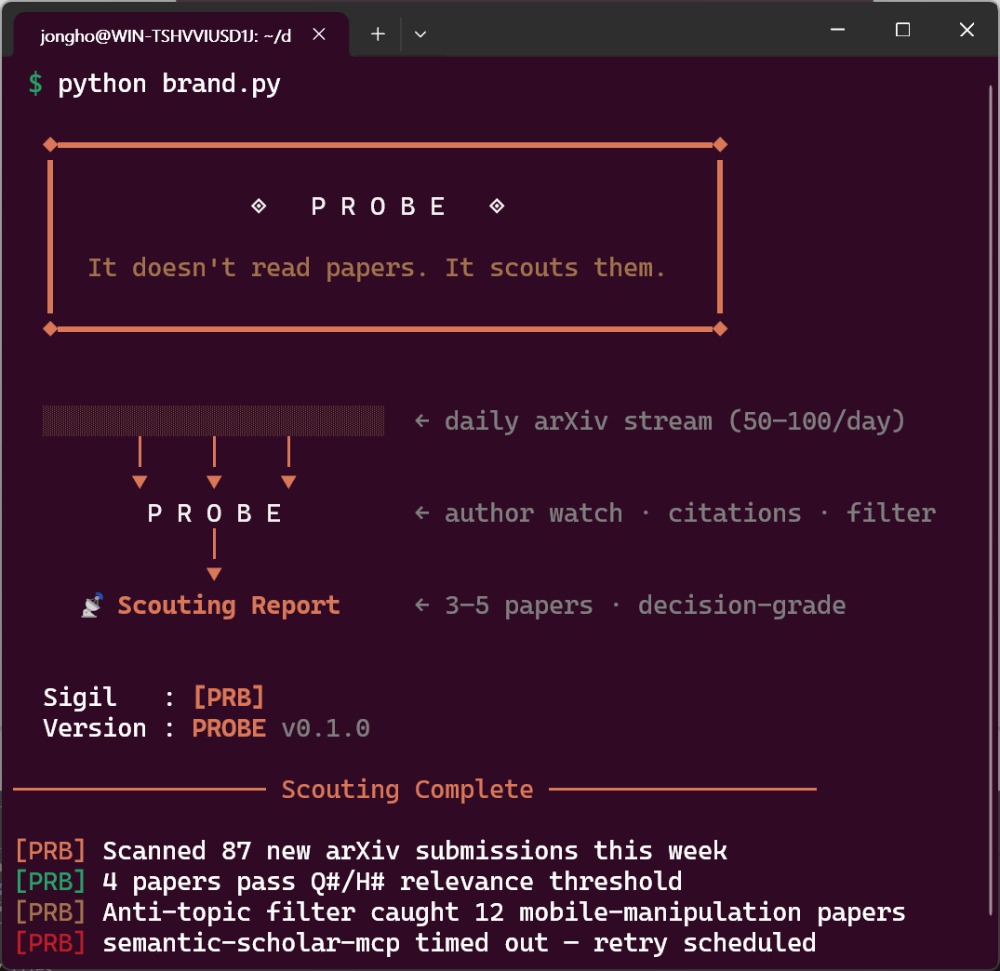

<div align="center">

# 🛸 PROBE · Research Scout for Dexterous Manipulation



**Stop drowning in arXiv. Start changing what you train next week.**

*Author watch · Citation-graph expansion · Anti-topic filtering · Weekly decision-grade Scouting Reports*

---

[](https://python.org)
[](https://claude.com/claude-code)
[](https://github.com/blazickjp/arxiv-mcp-server)
[](LICENSE)

📖 팀 온보딩 한글 문서: [`docs/INTRO_KO.md`](docs/INTRO_KO.md)

</div>

---

## 📌 Why PROBE?

Running dexterous manipulation RL is a full-time job. You tune reward curves, debug tactile pipelines, chase Sim-to-Real gaps — and somewhere between the hardware and the gradient logs, arXiv slips off the map.

The field does not wait. **50–100 new papers land on `cs.RO` + `cs.LG` every day.** Of those, maybe 3–5 per week actually touch hand-centric dexterous manipulation plus Sim-to-Real. That's a 3–5% signal rate in a firehose, and the cost of missing the right paper is re-solving a problem someone already published — the most expensive mistake a researcher can make.

**PROBE finds those 3–5 for you.**

But it does not stop at "here are some interesting papers." It asks the only question that matters:

> *"If this paper is right, what do I change in the Isaac Lab pipeline next week?"*

Summaries are cheap. PROBE produces **decision material**.

| Without PROBE | With PROBE |
|---|---|
| "I'll check arXiv this weekend" → never happens | Weekly Scouting Report lands in your repo |
| 50–100 papers/day → skim titles, remember none | 3–5 papers/week → scored, tied to your open questions |
| Survey mode: "this is interesting" | Decision mode: "change DR range on object mass to [0.5, 2.0] kg" |
| Re-discovering already-published solutions | Citation graph surfaces the prior art before you waste the week |
| Echo chamber — same authors, same methods | Monthly cross-pollination picks from adjacent fields |

---

## 📁 Repository Structure

```
probe/
│
├── research_context.md            # Static context — human-maintained
│                                  #   Active Questions (Q1–Q5)
│                                  #   Working Hypotheses (H1–H5)
│                                  #   Pinned Literature (≤ 8)
│                                  #   Researchers to Follow
│                                  #   Anti-topics (noise filter)
│
├── research_log/                  # Dynamic output — agent-generated
│   ├── _TEMPLATE.md               # Weekly Scouting Report form
│   ├── 2026-W16_EXAMPLE.md        # Output-quality reference
│   └── YYYY-W##.md                # Real weekly reports
│
├── docs/
│   └── INTRO_KO.md                # Korean onboarding + operations manual
│
├── brand.py                       # ASCII art, sigils, color constants
└── README.md                      # ← you are here
```

### Core principle: static vs. dynamic, never mixed

`research_context.md` and `research_log/` exist for one reason: to keep the agent's context lean.

- **Static** (`research_context.md`) changes monthly at most. The agent *reads* it, never writes.
- **Dynamic** (`research_log/`) is append-only. Each week is one file. The agent only reads the **last 2 weeks** when generating a new report.

Shove everything into one file and within six weeks the context bloats, the agent re-recommends last month's papers, and the pinned literature drifts into a mess.

---

## 🧭 The Pipeline

```
              ┌──────────────────────────────┐
              │     research_context.md      │  static · human-owned
              │  • Active Questions (Q1–Q5)  │
              │  • Hypotheses (H1–H5)        │
              │  • Pinned Literature (≤ 8)   │
              │  • Researchers to Follow     │
              │  • Anti-topics               │
              └──────────────┬───────────────┘
                             │ read-only (every run)
                             ▼
              ┌──────────────────────────────┐
              │           P R O B E          │
              │        (Claude Agent)        │
              │                              │
              │  1. Author Watch             │  ← highest signal
              │  2. Citation-Graph Expansion │  ← semantic, not keyword
              │  3. Keyword Sweep            │  ← noisy, last resort
              │                              │
              │  Score every candidate on:   │
              │    · Q# / H# relevance       │
              │    · Novelty vs. pinned      │
              │    · Reproducibility         │
              │    · Sim2Real evidence       │
              └──────────────┬───────────────┘
                             │ writes
                             ▼
              ┌──────────────────────────────┐
              │  research_log/YYYY-W##.md    │  Scouting Report
              │                              │
              │  Top 3–5 papers only         │
              │    · Connects to Q# / H#     │
              │    · What's genuinely new    │
              │    · Decision implication    │  ← the point
              │    · Failure mode to probe   │  ← the point
              └──────────────┬───────────────┘
                             │ informs
                             ▼
              ┌──────────────────────────────┐
              │           Human              │
              │                              │
              │  · Read, judge, discard      │
              │  · Update context (monthly)  │
              │  · Log feedback  (monthly)   │
              └──────────────────────────────┘
```

---

## 🧑‍🔬 Division of Labor

PROBE is a scout. It does not fight. The human still owns every judgement call.

| Human owns | Agent owns |
|---|---|
| **Direction** — is Q1 really the most important question? | **Author watch** — last 14 days of submissions from pinned researchers |
| **Hypothesis refinement** — if a paper shakes H3, rewrite it | **Citation-graph expansion** — semantic neighbors of pinned papers |
| **Evaluation protocol** — without this, no report matters | **Anti-topic filtering** — drop mobile-manip, locomotion, parallel grippers |
| **Monthly context update** — pinned papers, new hypotheses | **Scoring** — Q#/H# fit, novelty, reproducibility, Sim2Real evidence |
| **Feedback loop** — did any scouted paper change an experiment? | **Cross-pollination** — forced monthly pick from an adjacent field |
| **Discarding** — most papers won't matter, that's fine | **Self-check** — compare against last 2 weeks, no duplicate recs |

The agent **never** edits `research_context.md`. It can *propose* changes in the report. The human decides.

---

## ⚡ Quick Start

```bash
git clone https://github.com/jonghochoi/probe.git
cd probe
```

1. Open `research_context.md` and fill in **your** robot, stack, questions, hypotheses, and pinned papers. Shipping defaults are a Sharpa Hand / Isaac Lab template — useful as an example, not a universal config.
2. Decide how you want to run the agent — manually in a Claude.ai conversation, or fully scheduled via Claude Code Routines. See [Agent Setup Guide](#-agent-setup-guide) below.
3. Generate your first Scouting Report. Review it ruthlessly. Tune the prompt. Commit.

> 💡 **Do not automate on day one.** Run manually for 1–2 weeks until the report quality is where you want it. Bad prompt + full automation = weekly garbage generated on schedule.

---

## 🤖 Agent Setup Guide

This section walks you from zero to a scheduled, self-running PROBE agent. Three stages, each a concrete upgrade over the last.

```
Stage 1 (Week 1–2)  Manual      — paste context into Claude.ai, iterate on the prompt
Stage 2 (Week 3–4)  Semi-auto   — Claude desktop Scheduled Tasks (laptop must be open)
Stage 3 (Week 5+)   Full agent  — Claude Code Routines (cloud-scheduled, commits via PR)
```

You do **not** skip stages. The prompt that survives Stage 1 is the prompt you deploy in Stage 3.

---

### 🪜 Stage 1 — Manual run (Week 1–2)

Goal: produce two consecutive Scouting Reports that you'd actually read. Nothing is automated yet.

1. Open a new [Claude.ai](https://claude.ai) conversation with **Claude Sonnet** or **Opus**.
2. Upload (or paste) `research_context.md` as a project file.
3. Paste the **Scouting Prompt** (see below). Fill in the week marker.
4. Read the output against `research_log/_TEMPLATE.md`. If it fails the template, the prompt is the problem — not the agent.
5. Save the output as `research_log/YYYY-W##.md`, commit, repeat next week.

<details>
<summary><b>📋 Scouting Prompt (copy-paste)</b></summary>

```
You are PROBE — a research scout for hand-centric dexterous
manipulation RL.

CONTEXT (read-only):
- research_context.md  (attached)
- research_log/<last 2 weeks>.md  (attached)

TASK:
Produce a Scouting Report for week <YYYY-W##>.

PROCESS (in this order):
1. Author Watch — check last 14 days of arXiv submissions from
   every researcher listed in Section 5 of research_context.md.
2. Citation-Graph Expansion — for each Pinned paper in Section 4,
   list new papers (past 8 weeks) that cite it. Rank by semantic
   relevance to the Active Questions (Section 2), not keyword overlap.
3. Keyword Sweep — cs.RO + cs.LG, last 14 days, filter against
   the Anti-topics list (Section 7). This is the noisiest source;
   weight it lowest.

For every candidate paper, score on a 0–3 scale:
  · Relevance     — which Q# / H# does it touch?
  · Novelty       — genuinely new, or a δ over pinned work?
  · Reproducibility — code / data / hardware details?
  · Sim2Real      — real-robot evidence, or sim-only?

OUTPUT:
Follow research_log/_TEMPLATE.md exactly. Top 3–5 papers only.

For each paper, you MUST include both:
  · The arXiv ID in the form `arXiv:XXXX.XXXXX`
  · A direct Markdown hyperlink: `[arXiv:XXXX.XXXXX](https://arxiv.org/abs/XXXX.XXXXX)`
  If no arXiv preprint exists, use the DOI or official proceedings URL:
    `[DOI](https://doi.org/...)`
  If neither is available, write `[no public link]` explicitly.

For each paper, state:
  (a) which Q# or H# it touches,
  (b) what is *genuinely* new,
  (c) decision implication — what changes in MY Isaac Lab pipeline
      next week if this paper is right? Be concrete (config name,
      hyperparameter, specific metric). Vague is failure.
  (d) failure mode to probe first.

RULES:
- Do not recommend any paper already in research_log/ (last 2 weeks).
- Do not edit research_context.md. If you think a pinned paper
  should be replaced, write the suggestion in the report's
  "Context suggestions" section.
- If fewer than 3 papers pass score ≥ 2, say so. Do not pad.
- Once per month, force-include one paper from an adjacent field
  per Section 8 (Cross-pollination).
- Every paper link must be verified to resolve correctly before
  inclusion. Do not fabricate arXiv IDs.
```

</details>

---

### 🧩 Stage 2 — Semi-auto (Week 3–4)

Goal: the agent runs on a schedule, but tools/MCP are not yet wired. You're letting Claude re-generate reports automatically, still using its built-in web search for retrieval.

Use **Claude Desktop → Scheduled Tasks**:

1. Open Claude Desktop → Settings → Scheduled Tasks.
2. Create task: `PROBE weekly scout`.
3. Trigger: every Monday 09:00 Asia/Seoul.
4. Prompt: the same Scouting Prompt from Stage 1.
5. Attach `research_context.md` + last two `research_log/*.md` files.
6. Action: save the result to `research_log/YYYY-W##.md` (copy manually, or use the desktop's file-export hook).

Limitation: your laptop has to be awake and Claude Desktop has to be running. Good enough for a month; not good enough forever.

---

### 🛰️ Stage 3 — Full agent via Claude Code Routines (Week 5+)

This is the endgame: cloud-scheduled, tool-equipped, commits its own reports via pull request. No laptop, no reminders, no "did I run PROBE this week?"

**Prerequisites**

- [Claude Code](https://claude.com/claude-code) Pro plan (Routines requires cloud execution).
- GitHub repo connected to Claude Code (this repo).
- Two MCP servers installed:
  - [`blazickjp/arxiv-mcp-server`](https://github.com/blazickjp/arxiv-mcp-server) — arXiv search, topic watch, citation graph
  - [`zongmin-yu/semantic-scholar-fastmcp`](https://github.com/zongmin-yu/semantic-scholar-fastmcp) — citation/reference graph, author search

**Step 1 — Install MCP servers**

Add to your `~/.claude/mcp.json` (or project-local `.mcp.json`):

```json
{
  "mcpServers": {
    "arxiv": {
      "command": "uvx",
      "args": ["arxiv-mcp-server"]
    },
    "semantic-scholar": {
      "command": "uvx",
      "args": ["semantic-scholar-fastmcp"],
      "env": { "SEMANTIC_SCHOLAR_API_KEY": "<optional-but-recommended>" }
    }
  }
}
```

Verify locally first:

```bash
claude mcp list
# should show: arxiv ✓  semantic-scholar ✓
```

**Step 2 — Define the Routine**

Create `.claude/routines/probe-weekly.yaml`:

```yaml
name: probe-weekly-scout
description: Weekly arXiv scouting for hand-centric dexterous manipulation RL.

trigger:
  cron: "0 9 * * 1,4"          # Mon & Thu 09:00
  timezone: Asia/Seoul

model: claude-sonnet-4-6

mcp_servers:
  - arxiv
  - semantic-scholar

context_files:
  - research_context.md
  - research_log/_TEMPLATE.md
  - research_log/*.md           # last 2 weeks auto-truncated by the agent

prompt_file: .claude/prompts/scouting.md

output:
  mode: github_pr
  branch: probe/weekly-YYYY-W##
  path:   research_log/YYYY-W##.md
  title:  "chore(probe): scouting report YYYY-W##"
```

**Step 3 — Externalize the prompt**

Copy the Scouting Prompt from Stage 1 into `.claude/prompts/scouting.md`. Replace built-in web search instructions with explicit MCP tool calls:

```
Use the `arxiv.search_papers` tool for keyword sweeps and
topic-watch. Use `semantic-scholar.get_paper_citations` and
`semantic-scholar.get_author_papers` for citation-graph expansion
and author watch. Never fabricate a citation — if a tool call
fails, say so in the report.
```

**Step 4 — Register and dry-run**

```bash
claude routine register .claude/routines/probe-weekly.yaml
claude routine run probe-weekly-scout --dry-run
```

Inspect the dry-run output like you inspected the Stage 1 reports. If it's good, you're done — the routine will now run itself, push a PR each Monday and Thursday, and the PR description is your weekly changelog.

**Step 5 — Monthly human review**

Automation is not the finish line. Once a month, open `research_context.md` Section 9 (Feedback Loop) and fill in three numbers:

| Field | Question |
|---|---|
| Papers surfaced | How many did PROBE report this month? |
| Actually read | Of those, how many did *you* read? |
| Influenced a decision | Of those, how many changed an experiment? |

The ratio is PROBE's real KPI. If it trends to zero, the prompt is drifting — not the model.

---

### 🧰 Troubleshooting

| Symptom | Likely cause | Fix |
|---|---|---|
| Papers recommended are in your Anti-topics list | Anti-topics are too vague | Rewrite Section 7 with concrete exclusions (e.g. "any paper whose primary task is locomotion") |
| "Decision implication" is generic ("tune DR wider") | Prompt isn't forcing specificity | Add: "name the exact Isaac Lab config key and range" |
| Same paper recommended two weeks in a row | Agent skipped the last-2-weeks context | Confirm `research_log/*.md` glob is resolving and not empty |
| Agent silently edits `research_context.md` | Prompt guard missing | Re-add: "do NOT modify research_context.md under any circumstance" |
| Routine runs but PR is empty | MCP tool failure, swallowed | Check the routine run log; add "if any tool fails, include the error verbatim" to the prompt |

---

## 🧱 Agent Stack

| Component | Technology |
|---|---|
| **Agent engine** | Claude (Sonnet 4.6 / Opus 4.7) via Claude Code Routines |
| **Scheduler** | Claude Code Routines — cloud-managed cron, GitHub webhook output |
| **Paper search** | [`arxiv-mcp-server`](https://github.com/blazickjp/arxiv-mcp-server) — arXiv search + topic-watch + citation graph |
| **Citation graph** | [`semantic-scholar-fastmcp`](https://github.com/zongmin-yu/semantic-scholar-fastmcp-mcp-server) — citation/reference graph, author search |
| **Output** | GitHub PR — commit history *is* the research log |
| **Context** | `research_context.md` (static, human) + `research_log/` (dynamic, agent) |

---

## 📡 Signals That PROBE Is Actually Working

- At least **one paper per week** triggers a concrete change in your experiment design.
- The Anti-topics filter catches **≥ 10 papers/week** — that's the healthy exclusion rate.
- The agent reports "no paper scored ≥ 2 this week" without padding.
- Every 3 months, you can point at a line in `research_context.md` that moved because of a scouted paper.

If none of those are true after a month, the prompt is drifting or the pinned literature is stale. Fix the static context first, the prompt second. The model is almost never the problem.

---

## 🔗 Related Projects

| Project | Role |
|---|---|
| **[nexus](https://github.com/jonghochoi/nexus)** | Centralized RL experiment hub — MLflow + TensorBoard dual logging |
| **[observer](https://github.com/jonghochoi/observer)** | Automated evaluation pipeline — multi-view recording, failure-mode classification, checkpoint ranking |
| **probe** *(you are here)* | Research scouting — the upstream that decides *what is worth experimenting on at all* |

> `probe` → `nexus` → `observer` is one research loop.
> PROBE surfaces the idea. NEXUS logs the experiment. OBSERVER judges the policy.

---

## 📚 Further Reading

| Document | Description |
|---|---|
| [`docs/INTRO_KO.md`](docs/INTRO_KO.md) | Korean onboarding — motivation, pipeline, operations manual |
| [`research_context.md`](research_context.md) | Live research context — questions, hypotheses, pinned literature |
| [`research_log/_TEMPLATE.md`](research_log/_TEMPLATE.md) | Weekly Scouting Report template |
| [`research_log/2026-W16_EXAMPLE.md`](research_log/2026-W16_EXAMPLE.md) | Reference report — output-quality bar |
| [`brand.py`](brand.py) | ASCII art, sigil, and color constants |

---

<div align="center">

*"It doesn't read papers for you.*
*It scouts which papers change your mind."*

</div>
