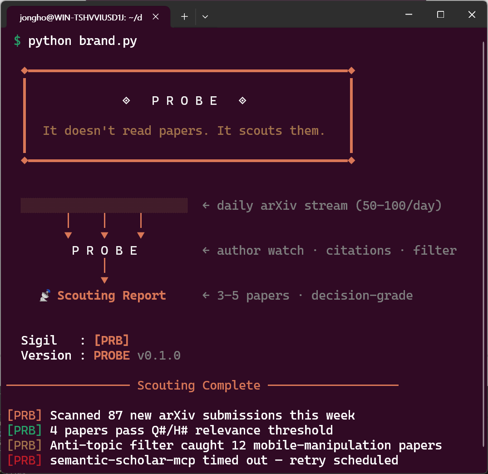

<div align="center">

# 🛸 PROBE · Research Scout for Dexterous Manipulation



**Stop drowning in arXiv. Start changing what you train next week.**

*Citation-graph expansion · Anti-topic filtering · Weekly decision-grade Scouting Reports*

[](https://python.org)
[](https://claude.com/claude-code)
[](https://info.arxiv.org/help/api/index.html)
[](https://api.semanticscholar.org/)
[](LICENSE)

</div>

---

> ### 📖 New here? Start with the onboarding guide.
>
> [`docs/probe-guide.html`](docs/probe-guide.html)
> — download and open in a browser for a full visual walkthrough of PROBE.
>
> ```bash
> git clone https://github.com/jonghochoi/probe.git
> open probe/docs/probe-guide.html         # macOS
> # xdg-open probe/docs/probe-guide.html   # Linux
> ```

---

## Why PROBE

Running dexterous-manipulation research is a full-time job — reward curves, tactile pipelines, Sim-to-Real gaps. Meanwhile **50–100 new papers land on `cs.RO` + `cs.LG` every day**, and maybe 3–5 a week actually touch hand-centric dexterous manipulation. That is a 3–5% signal rate in a firehose, and the cost of missing the right paper is re-solving a problem someone already published.

PROBE finds those 3–5 for you and refuses to let them die in your downloads folder. It does not stop at "here are some interesting papers" — it answers the only question that matters:

> *"If this paper is right, what do I change in my training / evaluation pipeline next week?"*

| Without PROBE | With PROBE |
|---|---|
| "I'll check arXiv this weekend" → never happens | A Scouting Report lands in your repo on a fixed cadence, per pillar |
| 50–100 papers/day → skim titles, remember none | 3–5 papers/run → scored, tied to your open questions |
| Survey mode: "this is interesting" | Decision mode: "change DR range on object mass to [0.5, 2.0] kg" |
| Re-discovering already-published solutions | Citation graph surfaces the prior art before you waste the week |
| "I'll read that paper properly later" → never does | `/analyze` → a Korean deep-dive anchored to your Decision Log |

**Division of labor.** PROBE is a scout — it does not fight. The agent owns citation-graph expansion, anti-topic filtering, scoring, and cross-pollination. The human owns every judgement call: direction, Decision-Log curation, evaluation thresholds, per-pillar context refresh, and discarding. The agent **never** edits any `context/` file — it proposes in a report; the human decides.

---

## Pipeline

PROBE has **two output tracks** sharing one static, human-owned context — outward `scouting/` (find) and focused `analysis/` (read deeply). Each runs on its own trigger and writes to its own folder.

> **Pillars**: the static context is organized into a small set of research pillars, each owning its own Decision Log and Tracked Literature — canonical names and definitions in [`context/MASTER.md`](context/MASTER.md) §5.
>
> **Anchor vs. per-pillar owner**: `context/MASTER.md` is a thin **global anchor** (the pillars + cross-cutting content — Identity, Pillars overview, Venue, Cross-pollination). Each `context/P#.md` **owns** its pillar's Decision Log, Tracked Literature, Anti-topics, and Curated Lists; the cloud scouting routine reads **one `P#.md`** to keep agent context lean. Edit the `P#.md` for pillar content; edit MASTER only for global content.

```
   ┌────────────────────────────────────────────────────────┐
   │ context/  (static · human-owned · read-only every run) │
   │ MASTER.md  · global anchor — Pillars + Venue           │
   │ P#.md      · per-pillar owners — Decision Log / lit    │
   └──────────────────────────┬─────────────────────────────┘
                              │ read-only (every run)
                              ▼
                          P R O B E
              ┌───────────────┴───────────────┐
              ▼                               ▼
   ┌────────────────────┐         ┌───────────────────────┐
   │      OUTWARD       │         │        FOCUSED        │
   │      Scouting      │         │   On-demand Analysis  │
   │ scheduled · per P# │         │       /analyze        │
   │                    │         │                       │
   │  citation graph ·  │         │ one paper → Korean    │
   │  keyword sweep ·   │         │   deep-dive, anchored │
   │   curated lists    │         │   to the Decision Log │
   └──────────┬─────────┘         └───────────┬───────────┘
              │ append new file               │ overwrite snapshot
              ▼                               ▼
   ┌────────────────────┐         ┌───────────────────────┐
   │     scouting/      │         │       analysis/       │
   │  P#/YYYY-MM-DD.md  │         │   <id>/analysis.md    │
   │    3–5 papers,     │         │    one folder per     │
   │   decision-grade   │         │         paper         │
   └──────────┬─────────┘         └───────────┬───────────┘
              └───────────────┬───────────────┘
                              ▼  informs
         Human — read, judge, discard, refresh context
```

**Static vs. dynamic, never mixed.** `context/` is static — it changes monthly at most, and the agent only *reads* it. The tracks are dynamic and agent-written: `scouting/` is append-only (one dated file per pillar per run; the next run reads only that pillar's last ~2 weeks), and `analysis/` is an overwrite-snapshot regenerated on demand. Keeping the two apart is what stops the agent re-recommending last month's papers as the context bloats.

The on-demand entry point (logic in `.claude/prompts/analysis.txt`; run it in a local session, one-shot `claude -p "/analyze 2410.07864"`, or on the web):

- `/analyze <arXiv id | url | pdf url>` → `analysis/<id>/analysis.md` — a Korean deep-dive: neutral paper summary, then the decision-grade half anchored to your `P#`/`D#`

The agent never edits `context/MASTER.md` or `context/P#.md`; each analysis run overwrites its `analysis/<id>/` snapshot (no append); input is one paper named explicitly on the command — there is no automatic `scouting/` → `analysis/` hand-off. The deep-dive index lives at [`analysis/README.md`](analysis/README.md).

---

## Agent Stack

Run `.claude/prompts/scouting.txt` by hand for a week or two before automating — the prompt that survives manual iteration is the one you deploy. A single template is shared across all pillars; replace `<PILLAR>` with the target pillar id before each run. Full setup for the scheduled scouting routine — cloud routines, network allowlist, troubleshooting — lives in [`docs/agent-setup.md`](docs/agent-setup.md). The on-demand `/analyze` command needs no routine setup: run it from any Claude Code session; its logic lives in `.claude/prompts/` and its output format in `docs/style.md`.

```bash
git clone https://github.com/jonghochoi/probe.git
cd probe
# 1. Fill context/MASTER.md (global anchor: Identity, Pillars overview), then each
#    context/P#.md with that pillar's Decision Log, Tracked Literature, watch list.
# 2. Generate a first Scouting Report by hand; review it ruthlessly; tune the prompt.
# 3. Only then schedule it as a routine — bad prompt + automation = garbage on a timer.
```

---

<div align="center">

*"It doesn't read papers for you.*
*It scouts which papers change your mind."*

</div>
