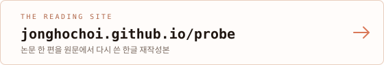

# <picture><source media="(prefers-color-scheme: dark)" srcset="assets/wordmark-dark.svg"></picture>

**Stop drowning in arXiv. Start from three to five papers a run, decision-grade.**

*Reports in Korean, published to a reading site.*

<a href="https://jonghochoi.github.io/probe/">
  <picture>
    <source media="(prefers-color-scheme: dark)" srcset="assets/reading-site-dark.svg">
    
  </picture>
</a>

---

## Why PROBE

**50–100 new papers** land on `cs.RO` + `cs.LG` every day. Maybe 3–5 a week
touch dexterous manipulation. PROBE finds those and answers three things
about each:

> *"Is this paper actually new, did it run on real hardware, and can I
> get the code?"*

| Without PROBE <picture><source media="(prefers-color-scheme: dark)" srcset="assets/probe-lost-dark.svg"></picture> | With PROBE <picture><source media="(prefers-color-scheme: dark)" srcset="assets/probe-locked-dark.svg"></picture> |
|---|---|
| 50–100 papers/day → skim titles, remember none → "I'll check arXiv this weekend" → never happens | 3–5 papers/run → scored, tied to your open decisions, landing in your repo on a fixed cadence, per pillar |
| Re-discovering already-published solutions | Citation graph surfaces the prior art before you waste the week |
| "I'll read that paper properly later" → never does | The one you do pick comes back as a Korean page you can finish in a sitting |

<picture>
  <source media="(prefers-color-scheme: dark)" srcset="assets/tagline-dark.svg">
  
</picture>

---

## How it works

<picture>
  <source media="(prefers-color-scheme: dark)" srcset="assets/flow-dark.svg">
  
</picture>

The agent **never** edits a `context/` file. It proposes in a report, the human
decides.

| Folder | Written by | Cadence | Write mode |
|---|:---:|---|---|
| `context/` | <picture><source media="(prefers-color-scheme: dark)" srcset="assets/human-dark.svg"></picture> human | monthly at most | agent reads only |
| `scouting/` | <picture><source media="(prefers-color-scheme: dark)" srcset="assets/probe-scouting-dark.svg"></picture> agent | scheduled, per pillar | append — one dated file per run |
| `analysis/` | <picture><source media="(prefers-color-scheme: dark)" srcset="assets/probe-analysis-dark.svg"></picture> agent | on demand | overwrite — one snapshot per paper |
| `comparison/` | <picture><source media="(prefers-color-scheme: dark)" srcset="assets/probe-comparison-dark.svg"></picture> agent | on demand | overwrite — one file per comparison |

One folder the agent only reads, three it only adds to — that split is what
stops it re-recommending last month's papers as `context/` grows.

**Comparisons read papers the corpus already has.** A comparison holds two or
three rewrites under one question and stays on where they diverge; each paper's
own detail lives on its own page, one link away. So only papers that already
have a rewrite may be compared — that is what lets the comparison link out
instead of explaining, and the build refuses to publish one that cannot.

**Pillars.** The context split is what keeps one run narrow.

- `context/MASTER.md` — cross-cutting content only; every run reads it.
- `context/P#.md` — one pillar's decision log, tracked literature and
  anti-topics; a scouting run reads **exactly one**.

Pillar names are in [`context/MASTER.md`](context/MASTER.md) §5.

---

## Use it

| Track | How to run | Output format |
|---|---|---|
| **Scouting** | [`SETUP.md`](SETUP.md) | [`scouting/AUTHORING.md`](scouting/AUTHORING.md) |
| **Analysis** | `/analyze <arXiv id>` | [`analysis/AUTHORING.md`](analysis/AUTHORING.md) |
| **Comparison** | by hand — the format and the pages are in place, the slash command is not | [`comparison/AUTHORING.md`](comparison/AUTHORING.md) |

- **One paper per `/analyze`**, named explicitly. No automatic `scouting/` →
  `analysis/` hand-off.
- **No arXiv HTML edition → skipped.** Never written from the abstract.
- **Starting from empty** — fill `context/`, generate one report by hand, review
  it ruthlessly, *then* schedule it. Bad prompt + automation = garbage on a
  timer.

