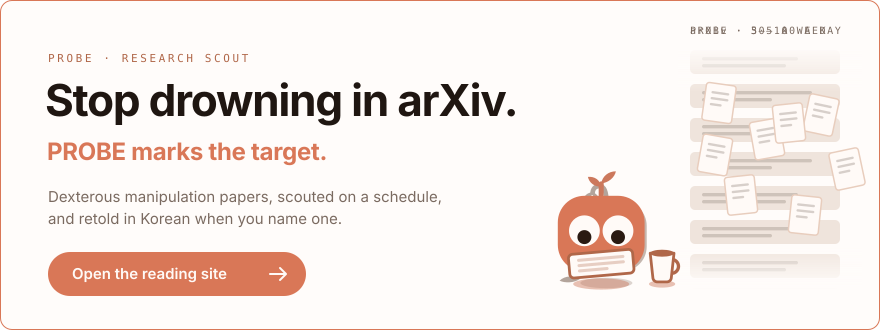
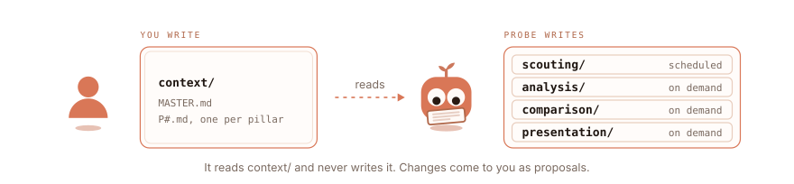

<a href="https://jonghochoi.github.io/probe/"><picture><source media="(prefers-color-scheme: dark)" srcset="assets/hero-dark.svg"></picture></a>

 

<b>Why PROBE</b> — from the arXiv flood to your next idea

 

| Without PROBE | With PROBE |
|---|---|
| Skim a hundred titles, remember none | **Scouting** — a few scored papers, tied to your open decisions |
| "I'll read it later" → never | **Analysis** — a Korean page you finish in a sitting |
| Three papers, the same claimed win | **Comparison** — only where they part |
| Slides the night before | **Presentation** — a talk, with what to say per slide |
| "Surely someone has tried this" | **Ideation** — the untried idea, and how to refute it |

Every rewrite starts from the arXiv original, not the abstract. Every judgement
is made against your own pillars and Decision Log. All of it publishes
together, in Korean, on the reading site.

<b>How it works</b> — you own the context, the agent writes the rest

 

<picture><source media="(prefers-color-scheme: dark)" srcset="assets/own-dark.svg"></picture>

`context/MASTER.md` holds what cuts across pillars, and each `context/P#.md`
holds one pillar's decision log, tracked literature and anti-topics.

| Track | You run in [Claude Code](https://claude.com/claude-code) | It writes |
|:---:|---|---|
| <picture><source media="(prefers-color-scheme: dark)" srcset="assets/probe-scouting-dark.svg"></picture> <b>Scouting</b> | scheduled, every pillar in one run — [setup](scouting/SETUP.md) · `/scout [pillars]` | `scouting/P#/<date>.md` and `scouting/runs/<date>.md` — [format](scouting/AUTHORING.md) |
| <picture><source media="(prefers-color-scheme: dark)" srcset="assets/probe-analysis-dark.svg"></picture> <b>Analysis</b> | `/analyze <arXiv id>` | `analysis/<id>.md` — [format](analysis/AUTHORING.md) |
| <picture><source media="(prefers-color-scheme: dark)" srcset="assets/probe-comparison-dark.svg"></picture> <b>Comparison</b> | `/compare <id> <id> [<id>]` | `comparison/<slug>.md` — [format](comparison/AUTHORING.md) |
| <picture><source media="(prefers-color-scheme: dark)" srcset="assets/probe-presentation-dark.svg"></picture> <b>Presentation</b> | `/present <arXiv id>` | `presentation/<id>.md` — [format](presentation/AUTHORING.md) |
| <picture><source media="(prefers-color-scheme: dark)" srcset="assets/probe-ideation-dark.svg"></picture> <b>Ideation</b> | `/ideate [<id \| alias \| topic>]` | nothing, it answers in chat |

<b>Ground rules</b> — what to know before you automate

 

- **Start by hand.** One report, reviewed ruthlessly, *then* the schedule.
- **You name the papers.** A report never feeds `analysis/` on its own.
- **No arXiv HTML, no rewrite.** Never written from the abstract.
- **The rewrite comes first.** `/compare` and `/present` read what `/analyze` wrote.

