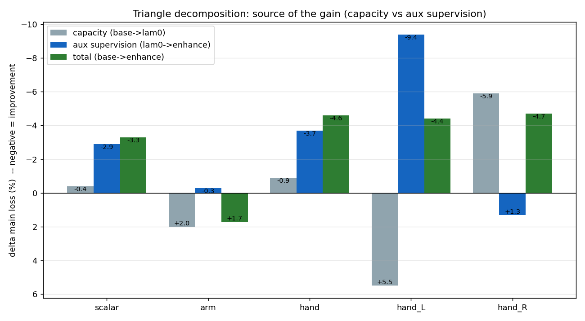
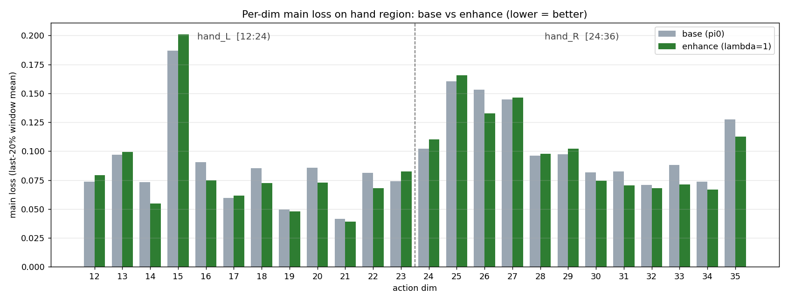

# pi0_enhance × Dexora 멀티태스크 — 학습 결과 분석 (Stage 3)

/ 데이터: `airbot_dexterous`(28 task · 2,299 ep · 773,601 frame, task_index 재인덱싱 후) ·
60K step · SEED 42 · 단일 GPU · `loss_main` 윈도우(마지막 20%) 비교 /

## 🧭 요약

같은 SEED·STEPS·BATCH·데이터로 **base(pi0) / λ0(enhancer만, 보조감독 OFF) /
enhance(λ=1)** 세 점을 돌려, "개선이 추가 파라미터(용량) 때문인지 보조 감독(논문
메커니즘) 때문인지"를 분리했다.

- **전체 main loss는 enhance가 base보다 −3.3%**, 그중 **−2.9%p(약 88%)가 보조
  감독**에서 왔고 용량 기여는 −0.4%p에 그친다.
- **손 영역 `[12:36)`은 −4.6%**(런북 성공 기준 "손 평균 loss enhance < base" 충족),
  역시 −3.7%p가 보조 감독 몫.
- 따라서 이 run은 **"보조 감독이 (용량이 아니라) 손 표현 학습을 개선한다"**는
  2511.00139의 핵심 주장을 멀티태스크 환경에서 재현한다.
- 다만 **좌우손이 정반대 경로로 움직인다** — 보조 감독은 왼손(−9.4%)을, 용량은
  오른손(−5.9%)을 돕는다. §🧠-3에서 원인을 분석한다.

## ⚙️ 실험 설정

| 항목 | 값 |
|---|---|
| 데이터셋 | `airbot_dexterous` (Dexora, v3.0, task_index 재인덱싱 완료) |
| 규모 | 28 task / 2,299 episode / 773,601 frame |
| pretrained | `lerobot/pi0_base` (projection 3개 + enhancer head는 fresh init) |
| 공통 | `SEED=42 STEPS=60000 BATCH_SIZE=8 NUM_WORKERS=4 USE_AMP=true` |
| 공통 | `TRAIN_EXPERT_ONLY=true GRADIENT_CHECKPOINTING=true` (VLM frozen) |
| 차원 | `arm_dim=12`, `max_state_dim=max_action_dim=40` (Dexora 39 수용) |

통제 삼각 (세 점의 유일한 차이):

| run | POLICY_TYPE | AUX_LOSS_WEIGHT | 의미 |
|---|---|---|---|
| `mt_base` | `pi0` | — | 바닐라 기준선 |
| `mt_lam0` | `pi0_enhance` | `0.0` | enhancer 아키텍처만, 보조감독 OFF (용량 통제군) |
| `mt_enhance` | `pi0_enhance` | `1.0` | 보조감독 ON (논문 메커니즘) |

## 🔬 측정 방법

- **`loss_main`으로 공정 비교.** enhance의 `train/loss`는 `L_main + λ(L_arm + L_hand)`
  합성이라 base의 main-only `loss`와 직접 비교 불가. `PI0EnhancePolicy.forward`가
  같이 남기는 **`loss_main` / `loss_main_per_dim`**(main-only)을 base의 `loss` /
  `loss_per_dim`과 맞대어 본다.
- **윈도우 평균(마지막 20% step).** per-dim loss는 step별 노이즈가 커서 최종 1개
  스냅샷은 단일 샘플에 휘둘린다. 마지막 20% step 평균으로 평탄화 (`--window 0.2`).
- **region 분해.** Dexora 39-DoF를 `arm_L/R [0:12)`, `hand_L/R [12:36)`로 좌우 분리해
  본다. **`head_spine [36:39)`은 보조 감독 비대상이라 본 분석에서 제외**한다(맥락
  정보로만 기록에 남김).

## 📊 삼각 분해 결과



| region | dims | base | λ0 | enhance | 용량<br>(base→λ0) | **보조감독**<br>(λ0→enhance) | 총<br>(base→enhance) |
|---|---|---|---|---|---|---|---|
| **scalar** (main MSE) | — | 0.07460 | 0.07432 | 0.07214 | 🟢 −0.4% | 🟢 **−2.9%** | 🟢 −3.3% |
| **arm** | `[0:12)` | 0.05147 | 0.05250 | 0.05234 | 🔴 +2.0% | 🟢 −0.3% | 🔴 +1.7% |
| └ arm_L | `[0:6)` | 0.03436 | 0.03500 | 0.03632 | 🔴 +1.8% | 🔴 +3.8% | 🔴 +5.7% |
| └ arm_R | `[6:12)` | 0.06858 | 0.07000 | 0.06835 | 🔴 +2.1% | 🟢 −2.4% | 🟢 −0.3% |
| **hand** | `[12:36)` | 0.09480 | 0.09391 | 0.09046 | 🟢 −0.9% | 🟢 **−3.7%** | 🟢 −4.6% |
| └ hand_L | `[12:24)` | 0.08311 | 0.08766 | 0.07943 | 🔴 +5.5% | 🟢 **−9.4%** (10/12) | 🟢 −4.4% |
| └ hand_R | `[24:36)` | 0.10649 | 0.10017 | 0.10149 | 🟢 −5.9% | 🔴 +1.3% | 🟢 −4.7% |

분해는 가산적이다(반올림 오차 내): scalar `−0.4 + −2.9 = −3.3`, hand `−0.9 + −3.7 = −4.6`.
즉 "용량 효과"와 "보조 감독 효과"는 독립적으로 더해진다.

## 🧮 손 영역 per-dim



| dim | side | base | λ0 | enhance | Δ(총) |
|---|---|---|---|---|---|
| 12 | L | 0.07350 | 0.07981 | 0.07917 | +0.00567 |
| 13 | L | 0.09672 | 0.10569 | 0.09934 | +0.00262 |
| 14 | L | 0.07311 | 0.11434 | 0.05480 | **−0.01831** |
| 15 | L | 0.18688 | 0.19293 | 0.20113 | +0.01425 |
| 16 | L | 0.09065 | 0.08323 | 0.07493 | −0.01572 |
| 17 | L | 0.05962 | 0.06203 | 0.06150 | +0.00188 |
| 18 | L | 0.08512 | 0.07842 | 0.07244 | −0.01267 |
| 19 | L | 0.04933 | 0.05384 | 0.04783 | −0.00150 |
| 20 | L | 0.08547 | 0.07929 | 0.07276 | −0.01271 |
| 21 | L | 0.04165 | 0.04637 | 0.03894 | −0.00271 |
| 22 | L | 0.08130 | 0.07587 | 0.06798 | −0.01332 |
| 23 | L | 0.07396 | 0.08015 | 0.08239 | +0.00843 |
| 24 | R | 0.10215 | 0.11025 | 0.11036 | +0.00821 |
| 25 | R | 0.16038 | 0.16505 | 0.16542 | +0.00504 |
| 26 | R | 0.15310 | 0.12764 | 0.13263 | −0.02047 |
| 27 | R | 0.14490 | 0.15072 | 0.14634 | +0.00144 |
| 28 | R | 0.09603 | 0.09874 | 0.09785 | +0.00182 |
| 29 | R | 0.09719 | 0.09992 | 0.10211 | +0.00491 |
| 30 | R | 0.08182 | 0.07145 | 0.07436 | −0.00745 |
| 31 | R | 0.08242 | 0.06809 | 0.07023 | −0.01219 |
| 32 | R | 0.07073 | 0.06645 | 0.06788 | −0.00286 |
| 33 | R | 0.08823 | 0.06848 | 0.07111 | −0.01711 |
| 34 | R | 0.07343 | 0.06279 | 0.06690 | −0.00653 |
| 35 | R | 0.12744 | 0.11240 | 0.11266 | −0.01479 |

**win은 hand 14/24**로 절반을 약간 넘는데, **평균 개선은 큰 폭으로 움직인 소수 dim이
견인**한다(예: dim 14 −0.018, 16 −0.016, 22 −0.013, 33 −0.017, 35 −0.015). 절반 가까운
dim은 거의 평탄하거나 미세 악화다. "균일하게 좋아졌다"가 아니라 "어려운 몇몇 손가락
관절에서 크게 좋아졌다"가 정확한 서술이다.

> dim 14가 특히 극적이다 — base 0.073 → 용량이 0.114로 **악화**시켰다가 보조 감독이
> 0.055로 **base보다도 아래**로 되돌린다. 용량이 흔든 차원을 보조 감독이 구제하는
> 패턴의 압축판.

## 📈 손실 곡선

step별 수렴 곡선(base `train/loss` vs λ0·enhance `train/loss_main`)은 학습 머신에서
`plot_curves.py`로 생성한다(원본 시계열이 `outputs/tb/*/metrics.csv`에만 있음):

```bash
$LEROBOT_PY analysis/2511.00139/impl/lerobot/plot_curves.py \
    --tb outputs/tb --out analysis/2511.00139/impl/lerobot/results \
    --base mt_base --lam0 mt_lam0 --enhance mt_enhance --window 0.2
```

생성된 `results/loss_curve.png`를 커밋하면 아래에 렌더된다:


## 🧠 해석

### 1. 개선은 용량이 아니라 보조 감독에서 왔다

전체 main loss 개선 −3.3% 중 보조 감독이 −2.9%p(≈88%), 손 영역 −4.6% 중 −3.7%p(≈80%).
enhancer 모듈을 그냥 얹는 것(λ0)은 거의 효과가 없고, **arm/hand 보조 supervision을 켰을
때** 비로소 손 표현이 좋아진다. 통제군 λ0이 "추가 파라미터" 가설을 깨끗이 기각해 준다.

### 2. 표적은 손, 그리고 성공 기준 충족

보조 감독은 설계 의도대로 **손 영역에 집중**된다(hand −3.7% vs arm −0.3%). 손 평균
loss가 enhance < base(0.09046 < 0.09480)로 런북 성공 기준을 만족한다.

### 3. 좌우손 비대칭 — 왜 이런 결과가 나오나

가장 눈에 띄는 현상: **용량은 오른손(−5.9%)을 돕고 왼손(+5.5%)을 해치는데, 보조 감독은
정반대로 왼손(−9.4%, 12개 중 10개 dim 승)을 강하게 돕고 오른손(+1.3%)엔 거의 무효**다.
아키텍처는 좌우를 구분하지 않으므로(`hand_mask`가 `[12:36)`을 한 덩어리로 처리) 이
비대칭은 **데이터에서 온다.** 가장 그럴듯한 설명:

1. **데이터 불균형 — 오른손은 단일+양손 과제 모두에, 왼손은 양손 과제에만 등장.**
   `airbot_dexterous`의 task 이름을 보면 `..._right` 단일팔 과제(pick_up_yellow_egg_right,
   pull_tissue_right, operate_pen_write_right 등 7+개)는 있어도 `..._left` 단일 과제는
   없다. 즉 **오른손은 더 다양·고변동(base loss 0.106 > 왼손 0.083)**, 왼손은 양손
   과제에서만 활성이고 단일-오른손 과제 동안엔 idle(rest pose)이다.

2. **용량은 gradient가 큰 쪽(오른손)으로 흐른다.** λ0은 보조 신호 없이 추가 파라미터만
   준다. main loss 평균 gradient는 고변동·고loss인 **오른손에 지배**되므로, 늘어난 용량이
   오른손 적합에 쓰여 오른손이 좋아지고(−5.9%) 왼손은 더 큰 모델과의 경쟁에서 오히려
   소폭 밀린다(+5.5%).

3. **보조 감독은 과소적합된 쪽(왼손)을 구제한다.** `L_hand`는 손 부분공간에 **dedicated
   gradient**를 주입한다. 왼손은 (idle 프레임 + 오른손 변동에 가려) main loss 평균에서
   과소대표돼 있던 터라, 전용 감독을 받자 그 학습 가능한 구조가 비로소 적합돼 −9.4%로
   크게 개선된다. 오른손은 이미 main loss가 충분한 gradient를 주던 포화 영역이라 보조
   신호의 한계 효용이 작고(+1.3%), enhancer 용량이 새로 도움이 되는 왼손으로 재배분되며
   미세하게 손해를 본다.

→ **"부익부(오른손)는 용량이, 빈익빈(왼손)은 보조 감독이" 담당**하고, 둘이 좌우로
상충하다가 총합에서 양손 모두 ~−4.5%로 수렴한다. 이는 보조 감독이 *추가 용량이 못 하는
일* — 과소적합 영역의 표적 구제 — 을 한다는 §🧠-1의 가장 강한 증거이기도 하다.

> 단, 이 해석은 **단일 시드 + task 이름 기반 추론**이다. 확정하려면 (i) 시드 2~3개로
> 좌우 패턴이 일관적인지, (ii) `airbot_dexterous`의 실제 좌/우손 활성 프레임 비율과
> 과제별 손 사용을 계측해야 한다(§🧪).

### 4. arm은 미세 악화

arm은 aux를 받는데도 총 +1.7%(arm_L 0/6 승)다. 절대값이 작아 critical하진 않지만,
enhancer 용량이 손 쪽으로 쏠리거나 멀티태스크 왼팔 신호가 노이지한 탓일 수 있다.
arm_R는 −0.3%로 사실상 평탄.

## ⚠️ 한계와 검증 과제

- **학습 loss ≠ task 성능.** 이건 train-time main MSE 개선이지 eval 성공률이 아니다.
  "손 표현이 더 잘 정렬됐다"는 신호로 읽되, 실제 정책 성능은 별도 평가가 필요하다.
- **단일 시드 — 에러바 없음.** scalar·hand 신호는 분해가 가산적·일관적이라 비교적
  견고하나, arm/head의 ±2% 수준과 좌우 비대칭의 정확한 크기는 시드 노이즈일 수 있다.
- **win count 중간.** 평균 개선이 소수 고-loss dim에 의해 견인된다(§🧮).
- **오프라인 로그 일부 손실.** wandb 바이너리 꼬리에서 run당 ~1.3K/70K 레코드가
  unparseable이라 `parse_wandb_offline.py`가 블록 단위로 복구했다. 윈도우(약 50 step)
  비교엔 충분하나, step 커버리지가 완전하진 않다.

## 🔁 재현

```bash
# 0. (최초 1회) 카테고리 데이터 task_index 재인덱싱 — repair_dexora_task_index 참조
# 1. 통제 삼각 학습 (각각 &  없이 포그라운드, 또는 GPU 0/1 병렬)
COMMON="LEROBOT_SRC=… LEROBOT_PY=… DATASET_DIR=…/airbot_dexterous \
        SEED=42 STEPS=60000 BATCH_SIZE=8 NUM_WORKERS=4 USE_AMP=true RUN_SMOKE=0 \
        TRAIN_EXPERT_ONLY=true GRADIENT_CHECKPOINTING=true LOG_FREQ=200 SAVE_FREQ=20000 \
        WANDB=true WANDB_MODE=offline"
env $COMMON GPU=0 POLICY_TYPE=pi0         OUTPUT_DIR=outputs/mt_base    bash setup_and_train.sh
env $COMMON GPU=1 POLICY_TYPE=pi0_enhance AUX_LOSS_WEIGHT=0.0 OUTPUT_DIR=outputs/mt_lam0    bash setup_and_train.sh
env $COMMON GPU=0 POLICY_TYPE=pi0_enhance AUX_LOSS_WEIGHT=1.0 OUTPUT_DIR=outputs/mt_enhance bash setup_and_train.sh

# 2. 오프라인 로그 추출
for r in mt_base mt_lam0 mt_enhance; do
  $PY parse_wandb_offline.py outputs/$r/wandb/latest-run -o outputs/tb/$r
done

# 3. 삼각 비교
$PY compare_runs.py outputs/tb/mt_base  outputs/tb/mt_lam0    --window 0.2 --per-dim
$PY compare_runs.py outputs/tb/mt_lam0  outputs/tb/mt_enhance --window 0.2 --per-dim
$PY compare_runs.py outputs/tb/mt_base  outputs/tb/mt_enhance --window 0.2 --per-dim

# 4. 그림
$PY plot_curves.py --tb outputs/tb --out analysis/2511.00139/impl/lerobot/results --window 0.2
```

## 🧪 후속 실험

- **λ sweep** (0.1/0.5/1.0/2.0) — 보조 감독 강도-효과 곡선과 포화점 확인.
- **multi-seed** (예: 43, 44) — 좌우 비대칭·arm 악화가 시드에 강건한지 검정.
- **데이터 균형 프로브** — `airbot_dexterous`의 좌/우손 활성 프레임 비율 + 과제별 손
  사용을 계측해 §🧠-3 가설(왼손 과소대표)을 직접 검증.
