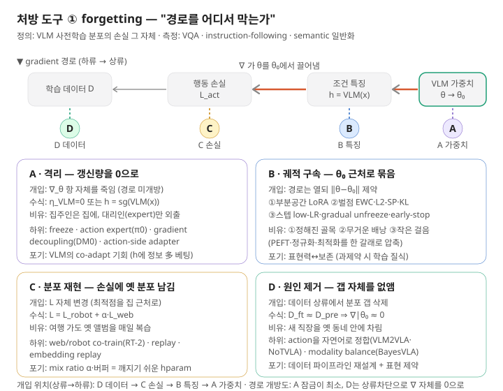
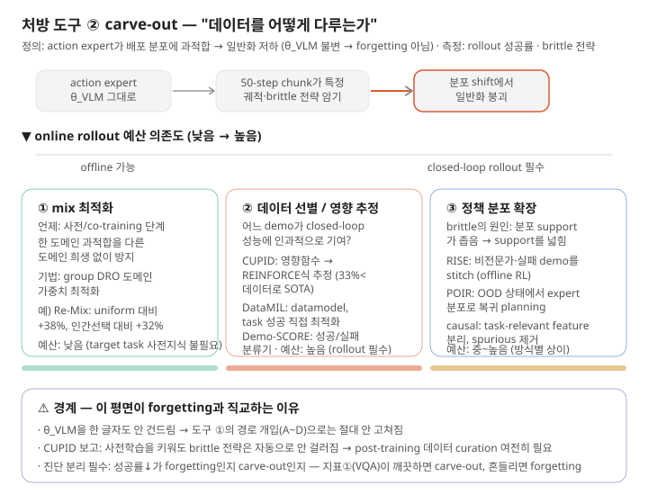

# VLA 사전학습 보존 — 통합 참조 문서

> 식별 단위는 모델 이름이 아니라 **lineage 2-튜플 = (초기 가중치) × (추가 사전학습 corpus)** 이다.
> 이 문서 전체를 관통하는 한 줄: **forgetting(평면 1)과 carve-out(평면 2)은 직교한다.**
> θ_VLM 경로 개입(A~D)으로는 평면 2가 안 고쳐지고, 데이터 선별로는 평면 1이 안 고쳐진다.

---

## 1. 두 처방 도구 — forgetting vs carve-out

둘은 "일반화가 떨어진다"는 *증상*은 닮았지만, 원인·측정·처방이 모두 다른 **별개 평면**이다. 혼동하면 엉뚱한 약을 처방한다.

| 구분 | **forgetting (평면 1)** | **carve-out (평면 2)** |
|---|---|---|
| 정의 | VLM 사전학습 분포의 손실 그 자체 | action expert가 배포 태스크 분포에 과적합 → 시스템 일반화 저하 |
| θ_VLM 변화 | **있음** (가중치가 θ₀에서 멀어짐) | **없음** (VLM 가중치 불변) |
| 원인 경로 | L_act gradient가 VLM 가중치/head로 역전파 | action-side 데이터의 brittle·편향 전략 |
| 측정 지표 | VQA · instruction-following · semantic 일반화 | rollout 성공률 · in-dist 포화 · brittle 전략 잔존 |
| 처방 | 보존 전략 A~D (경로 개입) | 데이터 선별 (CUPID · DataMIL · Re-Mix) |
| 발동 조건 | freeze를 벗어나거나 action을 자연어 토큰으로 표현할 때 | action expert가 좁은 배포 분포로 학습될 때 (항상 잠재) |

### 핵심 전제 사항 (이게 무너지면 전체 구조가 흔들림)

1. **forgetting의 좁은 정의.** forgetting은 원인(LoRA·추가 사전학습·mix 변화)에 종속된 개념이 아니라 "분포 손실 그 자체"다. 이 정의 덕분에 A~D를 *"gradient 경로의 어디를 건드리는가"* 하나로 줄 세울 수 있다.

2. **freeze면 경로가 닫힌다.** VLM을 완전 freeze로 묶으면 가중치가 수학적으로 못 움직이므로 손실 경로 자체가 차단되고, 보존 전략은 *대기 결정*으로만 존재한다. 단 예외 — action을 자연어 토큰으로 표현하면 language head가 학습되며 경로(b)가 열린다.

3. **두 평면의 공존.** "사전학습이 본질"이라는 대전제와 "carve-out은 사전학습으로 안 풀린다"는 모순이 아니다. CUPID 논문이 직접 보고: <cite>VLA의 사전학습을 키운다고 해서 모델이 그 일반 지식을 활용해 저품질·brittle한 전략을 무시하게 되지는 않으며, 따라서 VLA post-training에서도 데이터 curation은 여전히 중요하다.</cite> (CUPID, arXiv:2506.19121)

4. **측정 비용의 비대칭.** 지표①(VQA)은 싸고 offline. 지표②(rollout)는 비싸고 online이며 CUPID의 *전제*다. 예산이 ②에 안 잡히면 carve-out을 측정조차 못 한다.

---

## 2. forgetting 관점 — 네 갈래 (수식과 비유로)

### 2.0 공통 척추: 망각의 update 방정식

네 갈래를 묶는 한 줄. fine-tuning 은 행동 손실 $L_{\text{act}}$ 의 gradient 를 따라 VLM 가중치를 갱신한다:

$$
\theta_{\text{VLM}} \leftarrow \theta_{\text{VLM}} - \eta \cdot \nabla_{\theta_{\text{VLM}}} L_{\text{act}}, \qquad \nabla_{\theta_{\text{VLM}}} L_{\text{act}} = \underbrace{\frac{\partial L_{\text{act}}}{\partial h}}_{\text{loss}\to\text{feat}} \cdot \underbrace{\frac{\partial h}{\partial \theta_{\text{VLM}}}}_{\text{feat}\to\text{weights}}
$$

> 밑 첨자 표기 — loss = 행동 손실 $L_{\text{act}}$, feat = 조건 특징 $h$, weights = VLM 가중치 $\theta_{\text{VLM}}$.

여기서 $h = \text{VLM}(\text{image}, \text{text})$ 는 VLM 이 내놓는 조건 특징이다. **망각의 양은 곧 $\Vert\theta_{\text{VLM}} - \theta_0\Vert$** (가중치 공간) 또는 $D_{\text{KL}}(p_{\theta_0} \,\Vert\, p_{\theta})$ (함수 공간) 다.

> **비유**: $\theta_0$가 *집*이고 fine-tuning은 *집을 떠나는 여행*, 망각은 *집에서 얼마나 멀어졌나*다.
> 집을 잊지 않는 방법은 위 방정식의 네 군데를 건드리는 것 — 이게 네 갈래의 정체다.

---

### 2.1 격리 (A) — "갱신량을 0으로"

방정식에서 $\nabla_{\theta_{\text{VLM}}} L_{\text{act}}$ 항 자체를 죽인다. 두 방식:

**(a) freeze**: $\eta_{\text{VLM}} = 0$. 가중치가 수학적으로 못 움직임.
**(b) gradient 차단 (action expert / decoupling)**: 조건 특징을 stop-gradient 로 끊는다. $h = \text{sg}(\text{VLM}(x))$ 로 두면 $\dfrac{\partial h}{\partial \theta_{\text{VLM}}}$ 경로가 0 이 되어, expert 는 학습되지만 VLM 은 못 움직인다.

π0 계열은 행동을 flow matching 으로 예측한다 — **flow matching** 은 노이즈 $\varepsilon$ 에서 실제 행동 $A$ 로 가는 속도장을 배우는 것:

$$
A^\tau = \tau A + (1-\tau)\varepsilon, \qquad L_{\text{FM}} = \mathbb{E}\,\big\Vert v_\theta(A^\tau, \tau, \underbrace{c}_{=\,h}) - (A - \varepsilon) \big\Vert^2
$$

조건 $c$ 에 $\text{sg}(\cdot)$ 를 씌우는 순간 (DM0 의 hybrid gradient) VLM 은 embodied 학습에서 완전히 분리된다.

> **비유**: 집주인(VLM)은 집에 머물고, 대리인(expert)을 내보내 일을 시킨다. 대리인이 아무리 멀리 가도 집주인은 한 발짝도 안 움직인다.
> **포기**: 집주인이 *현장에 맞춰 co-adapt할 기회*. VLM 특징 $h$ 안에 제어에 필요한 정보가 이미 다 있다는 데 베팅 — 없으면 ceiling이 거기서 막힌다.

| 하위 항목 | 대표 기술 · 논문 |
|---|---|
| ① full freeze | $\eta_{\text{VLM}}=0$ (다수 VLA의 default) |
| ② gradient 차단 / decoupling | DM0 (hybrid/decoupled gradient) |
| ③ action expert (별도 출력부) | π0 — flow matching expert (Black et al. 2024/2025); RDT |
| ④ action-side adapter | VLA-Adapter — Bridge Attention, 0.5B (arXiv:2509.09372) ※반례 트랙 |

---

### 2.2 궤적 구속 (B) — "갱신은 허용하되, θ₀ 근처로"

경로는 열되 ($\nabla \neq 0$) 갱신의 *형태·크기·방향*을 제약한다. 세 하위 메커니즘 — **PEFT·정규화·최적화로 흩어졌던 것을 여기 한 갈래로 압축**한다. 셋 다 "가중치는 움직일 수 있되 집 근처에 묶는다"는 같은 동작이기 때문이다.

**① 부분공간 제약 — LoRA (Low-Rank Adaptation, 저차원 적응)**

$$
W = W_0 + \Delta W, \quad \Delta W = BA, \quad B \in \mathbb{R}^{d\times r},\; A \in \mathbb{R}^{r\times k},\; r \ll \min(d,k)
$$

$W_0$ 는 freeze, 작은 $A, B$ 만 학습. 갱신이 $r$ 차원 부분공간에 갇혀 *멀리 갈 수 있는 방향 자체가 제한*된다.

> **비유**: 집에서 나가되 *정해진 몇 개의 골목*으로만.

**② 손실 벌점 — EWC, L2-SP, distillation**

**L2-SP** (L2 toward Starting Point, 시작점 향한 L2):

$$
L + \frac{\lambda}{2}\,\Vert\theta - \theta_0\Vert^2
$$

**EWC** (Elastic Weight Consolidation, 탄성 가중치 통합):

$$
L + \frac{\lambda}{2}\sum_i F_i\,(\theta_i - \theta_{0,i})^2, \qquad F_i = \mathbb{E}\big[(\partial_{\theta_i}\log p_{\theta_0})^2\big]
$$

(Fisher 정보 = 옛 분포에 그 파라미터가 얼마나 중요한가)

**distillation / KL-to-reference**:

$$
L + \beta\,\mathbb{E}_x\, D_{\text{KL}}\!\big(p_{\theta_0}(y\,|\,x)\,\Vert\,p_\theta(y\,|\,x)\big)
$$

— 가중치가 아니라 *출력 분포*를 frozen teacher 에 묶음.

> **비유**: L2-SP 는 *집에서 멀어질수록 무거워지는 배낭*. EWC 는 그 배낭이 "중요한 방향으로만 무거운" 선택적 버전. distillation 은 가중치 위치가 아니라 *행동 (출력) 이 옛날과 같은지*를 본다.

**③ 스텝 제약 — LR (learning rate) 계열**

$$
\theta_T - \theta_0 = -\sum_{t=1}^{T} \eta_t \nabla_t \;\Rightarrow\; \Vert\theta_T - \theta_0\Vert \le \sum_t \eta_t\,\Vert\nabla_t\Vert
$$

작은 $\eta$, layer-wise decay ($\eta_\ell = \eta\,\gamma^{\text{depth}}$), gradual unfreezing, early stopping — 전부 *총 이동 거리의 상한*을 줄인다.

> **비유**: 한 걸음을 아주 작게 떼거나, 일찍 멈춘다.
> **포기 (B 공통)**: 표현력 ↔ 보존. rank 가 너무 낮거나 벌점이 너무 세면 *진짜 필요한 새 행동 특징의 학습이 질식*한다.

| 하위 항목 | 대표 기술 · 논문 |
|---|---|
| ① 부분공간 (PEFT) | LoRA (Hu et al. 2021); DoRA; (IA)³; adapter layers (Houlsby et al. 2019) |
| ② 손실 벌점 (정규화) | EWC (Kirkpatrick et al. 2017); L2-SP (Li et al. 2018); LwF/KL-distill (Li & Hoiem 2017) |
| ③ 스텝 제약 (최적화) | low LR; layer-wise LR decay (ULMFiT, Howard & Ruder 2018); gradual unfreezing; early stopping |

---

### 2.3 분포 재현 (C) — "손실에 옛 분포를 계속 남긴다"

B 와 결정적으로 다르다. B 는 가중치 이동을 *직접* 막지만, C 는 **손실 함수 $L$ 자체를 바꿔 최적점이 집 근처에 머물게** 한다:

$$
L = L_{\text{robot}}(\mathcal{D}_{\text{robot}}) + \alpha \, L_{\text{web}}(\mathcal{D}_{\text{web}})
$$

$L_{\text{web}}$ 이 계속 살아있으니 gradient 가 robot 쪽으로만 쏠리지 못한다. RT-2 의 web/robot co-fine-tuning 이 이 원형. embedding replay 는 원본 이미지 대신 frozen 백본 임베딩만 저장해 비용을 줄인다.

> **비유**: 여행을 떠나도 *옛 앨범을 매일 복습*해 고향을 안 잊는다. B 가 "몸에 목줄을 맨다"면 C 는 "옛 친구를 계속 초대한다."
> **포기**: mix ratio $\alpha$ 와 버퍼 크기가 *깨지기 쉬운 hyperparameter* + 옛 데이터 수집·저장 비용. 강건성 연구는 *작은 replay 만으로 충분*할 수 있다 했으니, $\alpha$ 를 크게 두기 전에 측정부터.

| 하위 항목 | 대표 기술 · 논문 |
|---|---|
| ① web/robot co-fine-tuning | RT-2 (Brohan et al. 2023); OpenVLA의 co-train 변형 |
| ② experience replay | rehearsal (Rolnick et al. 2019); 작은 버퍼 zero-forgetting 보고 |
| ③ embedding/feature replay | frozen-embedding replay (원본 대신 임베딩 저장) |

---

### 2.4 원인 제거 (D) — "갭 자체를 없앤다"

A·B·C 가 *사후 방어*라면 D 는 *상류 제거*다. 망각의 근본 원인이 "사전학습 분포 ≠ fine-tuning 분포"라면, 그 갭을 데이터 레벨에서 없애면 된다. 분포가 같으면:

$$
\mathcal{D}_{\text{finetune}} \approx \mathcal{D}_{\text{pretrain}} \;\Rightarrow\; \nabla_{\theta_{\text{VLM}}} L_{\text{act}} \big|_{\theta_0} \approx 0
$$

즉, $\theta$ 가 집 (= $\theta_0$) 을 떠날 이유가 없다.

VLM2VLA의 진단: <cite>이 catastrophic forgetting은 VLM의 인터넷 규모 사전학습 corpus와 로보틱스 fine-tuning 데이터 사이의 분포 불일치 때문이다.</cite> 그 처방으로 <cite>저수준 행동을 자연어로 표현해 데이터 레벨에서 불일치를 먼저 해소하고, 이로써 LoRA만으로 VLA를 학습해 backbone을 최소 수정하며 catastrophic forgetting을 회피한다.</cite> (VLM2VLA, arXiv:2509.22195)

> **비유**: 새 직장을 *옛 동네 안에* 차린다. 출근해도 집에서 멀어질 일이 없다 — 갈등을 사후 중재하는 대신 갈등의 원인을 없앤 것.
> **포기**: 데이터 파이프라인 재설계 비용 + 행동 표현이 자연어 정합에 묶이는 제약.

| 하위 항목 | 대표 기술 · 논문 |
|---|---|
| ① action을 자연어로 정합 | VLM2VLA / Actions-as-Language (Hancock et al. 2025, arXiv:2509.22195); NoTVLA (arXiv:2510.03895) |
| ② modality imbalance 교정 | BayesVLA (언어 다양성 ≪ 시각·행동 다양성 교정) |

### 갈래 간 경계 주의

- **B vs C**: 둘 다 "경로를 연다"는 점은 같지만 메커니즘 정반대 (B=가중치 직접 제약, C=손실에 옛 분포). "LoRA+co-train"을 같이 쓰면 무엇이 보존을 일으켰는지 **귀속 불가** → 첫 시뮬에서는 한 번에 한 갈래만.
- **A의 head 누수**: freeze가 가중치를 묶어도 action을 자연어 토큰으로 표현하면 language head 경로(b)가 열린다 → freeze ≠ 완전 안전.

---

## 3. carve-out 관점 — 할 수 있는 것들 (신규)

carve-out은 θ_VLM 불변이므로 보존 전략으로 못 고친다. 처방은 전부 **action-side 데이터 평면**에 있다. NoTVLA의 경고가 이 평면의 존재를 외부에서 뒷받침: <cite>dense한 로봇 supervision이 backbone을 embodiment 특화 운동 통계 쪽으로 끌어당겨, 의미 추론과 행동 생성 사이의 간극을 오히려 넓힐 수 있다.</cite> (NoTVLA, arXiv:2510.03895)

### 3.1 데이터 mix 최적화 (사전/co-training 단계)

| 도구 | 메커니즘 | 출처 |
|---|---|---|
| **Re-Mix** | group DRO로 도메인 가중치 최적화 — 한 도메인 과적합을 다른 도메인 희생 없이 방지 | <cite>학습된 도메인 가중치가 uniform 대비 평균 38%, 인간 선택 가중치 대비 32% 성능 향상.</cite> (arXiv:2408.14037) |

### 3.2 데이터 선별 / 영향 추정 (closed-loop 예산 필요)

| 도구 | 메커니즘 | 전제 · 출처 |
|---|---|---|
| **CUPID** | 영향함수로 각 demo가 정책의 기대 return에 미치는 인과적 영향을 추정 → filter/select | online rollout 예산 필요. <cite>curated 데이터의 33% 미만으로도 RoboMimic에서 SOTA diffusion policy 달성.</cite> (arXiv:2506.19121) |
| **DataMIL** | datamodel 패러다임 — 정책 자체로 어떤 데이터가 성능을 올릴지 end-to-end 추론 | <cite>의미·시각 유사도 같은 인간 휴리스틱으로 거르는 대신 task 성공을 직접 최적화해 데이터를 선별한다.</cite> (arXiv:2505.09603) |
| **Demo-SCORE** | 성공/실패 rollout을 구분하는 분류기를 여러 체크포인트에 걸쳐 학습 → brittle 전략 식별 | <cite>rollout 분포가 원본 demo 분포와 완벽히 일치하지 않아 분류기가 과적합할 수 있다는 약점.</cite> (arXiv:2503.03707) |

### 3.3 정책 분포 자체를 넓히기

| 접근 | 메커니즘 | 출처 |
|---|---|---|
| 비전문가 데이터 + offline RL | undirected play·실패 demo를 stitch해 정책 분포의 support를 넓혀 recovery·일반화 강화 | RISE (arXiv:2510.19495) |
| return-to-distribution planning | 배포 환경의 OOD 상태에서 expert 분포로 복귀하도록 world model을 online fine-tune | POIR (arXiv:2305.01400) |
| 인과적 feature 분리 | task-relevant feature와 spurious correlation을 분리해 과적합 감소 | causal confusion 계열 (arXiv:2507.22380, de Haan et al.) |

> **carve-out 측정의 핵심**: rollout 성공률 하나로는 부족 — *어떤 demo/전략*이 brittle한지를 분해해야 처방이 가능하다. 그래서 3.2의 영향-기반 도구가 단순 성공률 모니터링보다 강하다. 단 전부 online rollout 예산을 전제로 한다.

---

## 4. 액션 아이템 — staged training recipe

4-stage recipe를 척추로, 각 단계의 *할 일 · 핵심 점검 · 다음 단계 트리거*만 추린다. 이 사다리는 사실 **forgetting을 단계적으로 여는 실험 경로**다 — Stage 2(잠금)→3(좁게 개방)→4(활짝)로 경로를 점점 열며 분포가 어떻게 손실되는지 본다. 따라서 이번 stage 전반의 주 측정은 **지표①(VLM 분포 손실: VQA·instruction-following·semantic 일반화)**이고, 지표②(rollout 성공률)는 학습이 degenerate한지만 거르는 부차 지표다. carve-out 본격 진단·rollout 예산은 후속 stage로 미룬다.

### Stage 1 — VLM 자산 확보 (lineage 선택 / alignment 유지)

- **할 일**: 어떤 lineage = (초기 가중치) × (추가 사전학습 corpus)를 가져올지 결정. 랜드마크(π·GR00T·MolmoAct2·Being-H0.5·Xiaomi-Robotics-0)가 무엇 위에 무엇을 적층했는지 카탈로그로 정리.
- **핵심 점검**: 이 단계엔 성격이 다른 두 일이 섞여 있다 — *체크포인트 선택*(학습 없음)과 *alignment 유지/추가 사전학습*(학습 있음). 둘을 별도 하위 작업으로 떼어 둬야 나중에 trigger가 안 섞인다.
- **다음 트리거**: lineage 1개를 default로 확정 → Stage 2 착수.

### Stage 2 — VLM freeze + ActionExpert/HandExpert 학습

- **할 일**: VLM을 freeze한 채 action expert만 학습. action 표현은 이번 stage에 한해 `(flow/diffusion expert, 관여 최소, 50-step chunk)`로 고정.
- **핵심 점검 (baseline 정화)**: freeze인데도 지표①이 흔들리면 → 경로가 실제로 안 닫힌 것(cross-attention gradient 누수 또는 chunk tokenization의 LM head 오염). *위로 가기 전에* stop-gradient·freeze를 강화해 ①을 깨끗이 만든다. 이게 돼야 이후 단계의 ① 변화를 *순수하게 경로 개방 탓*으로 귀속할 수 있다.
- **다음 트리거**: 지표① 보존 확인(forgetting≈0 기준선 확보) → Stage 3.

### Stage 3 — LoRA / adapter / top-layer 제한적 fine-tuning

- **할 일**: 경로를 좁게 연다. LoRA(rank 작게부터) 또는 상위 레이어만 unfreeze.
- **핵심 점검**: 경로를 연 대가로 지표①이 그리는 손실 곡선을 측정 — rank·레이어를 키울 때 ①이 얼마나 떨어지는가가 곧 forgetting의 실측 데이터. rank↑에도 ①이 안 떨어지면 좋은 소식(기록), 떨어지면 trade-off가 실재.
- **다음 트리거**: ① 손실이 허용 범위 밖이거나 지표② 이득이 정체 → Stage 4 검토. 한 번에 한 기법만(LoRA·co-train 섞으면 귀속 불가, 2장 '갈래 간 경계 주의' 참조).

### Stage 4 — small-LR full fine-tuning + prior-preserving regularization (필요 시)

- **할 일**: 전체를 작은 LR로 풀되 보존 정규화(EWC·L2-SP·distillation)를 함께 건다.
- **핵심 점검**: 정규화 강도를 올렸을 때 지표①은 회복되는데 지표②가 동반 붕괴하면 → 과제약. 정규화로는 분리 불가능한 문제이므로 action 표현(관여도) 자체를 재검토.
- **다음 트리거**: 이 stage는 *필요 시*에만. Stage 2~3에서 충분하면 진입하지 않는다.

---

## 5. 보존을 어떻게 정의·측정하는가 (지표①)

forgetting을 "분포 손실 그 자체"로 정의했으므로, 그 손실을 *무엇으로 관측*할지가 정해지지 않으면 Stage 2~4에서 무엇이 움직였는지 반증할 수 없다. 먼저 프레임을 가른다 — "지표① 측정"은 사실 두 질문이 섞여 있다: (a) *분포 손실 그 자체*를 재는가, (b) 그 손실이 *능력 저하로 드러난 결과*를 재는가. 정의에 충실한 건 (a)지만 실무는 거의 (b)로 한다. 이 간극을 인지하는 게 측정 설계의 출발점이다.

### 5.1 세 측정 family — 정의 충실도 ↔ 비용

**① 함수/행동 측정 (output space) — 실무 표준, 정의엔 간접**

base VLM이 갖고 있던 능력을 벤치마크로 fine-tune 전/후 비교한다. VLM2VLA가 이 방식 — <cite>VQA 연구와 800회 이상의 실세계 실험으로 VLM의 핵심 능력 보존, open-world 의미 추론·다국어 instruction following으로의 zero-shot 일반화를 입증</cite> (arXiv:2509.22195). 구체 도구:
- **VQA 정확도**: VQAv2 · GQA · TextVQA(OCR) · RefCOCO. 연속학습 VLM의 표준 — <cite>각 단계까지 학습 후 vision-language task 정확도를 측정해, 행이 안정적이면 지식 보존, 후속 단계 학습 후 이전 task가 떨어지면 catastrophic forgetting으로 판정</cite> (Continual LLaVA, CoLLAs 2025).
- **reasoning 진단**: 단답 VQA는 표면만 본다. <cite>최종 답 metric과 micro-level 추론 품질을 비교하면, 최종 결정이 무너져도 추론 trace는 상대적으로 더 안정적인 계층적 forgetting 패턴이 나타난다</cite> (MLLM-CTBench, arXiv:2508.08275) → 단답만 보면 forgetting을 과소평가.
- 핵심 metric: **BWT(Backward Transfer)** — 새 task 학습 후 옛 task 성능 변화, 음수일수록 forgetting.

**② 분포/divergence 측정 (probability space) — 정의에 가장 충실, 주 권장**

벤치 정확도가 아니라 *확률 분포의 이동*을 직접 잰다. "분포 손실 그 자체" 정의에 직결되고, forgetting의 *진짜 예측 변수*다.

$$\text{forgetting} \;\propto\; D_{\text{KL}}\big(p_{\theta_0}(\cdot|x)\,\|\,p_{\theta}(\cdot|x)\big), \quad x \sim \text{fixed probe}$$

- 고정 probe(웹/VQA 텍스트)에서 base와 fine-tuned의 next-token 분포 KL, 또는 perplexity/NLL 변화.
- 데이터 접근이 없을 때: <cite>context-free generation으로 원본과 새 모델 사이 KL divergence를 근사적으로 unbiased하게 추정</cite>할 수 있다 (arXiv:2505.13811) — base VLM 자기 생성 샘플로 두 분포 비교.
- **왜 ②가 ①보다 강한가**: <cite>forgetting 정도는 학습 알고리즘 자체가 아니라 새 task 분포에서 평가한 base 대비 forward KL divergence로 결정되며, weight-space 변화·hidden representation drift·대안 분포 metric(reverse KL·TV·L2) 어느 것도 forward KL만큼의 예측력을 못 보였다</cite> (RL's Razor, arXiv:2509.04259).

**③ weight/representation 측정 — 싸지만 약함, 보조용**

$\|\theta - \theta_0\|$(또는 Fisher 가중), CKA·linear probing으로 표현 drift. 단 위 RL's Razor가 명시적으로 경고하듯 예측력이 forward KL에 못 미치므로 *진단 보조*로만.

### 5.2 당신 setup의 결정적 단서 — Stage 2에서 ③은 0이다

Stage 2는 VLM freeze라 $\theta_{\text{VLM}}=\theta_0$ → $\|\theta-\theta_0\|=0$이 *구성상 자명*하다. 그러면 Stage 2의 ① 측정은 forgetting 측정이 아니라 **freeze 무결성 검증**이다:
- flow/diffusion expert는 VLM의 language/VQA head를 안 쓰므로(별도 경로), 그 head로 VQA를 직접 질의 가능 → base VLM과 **동일**해야 정상.
- freeze인데도 ①이 흔들리면 → cross-attention gradient 누수 또는 chunk tokenization의 LM head 오염. forgetting이 아니라 *freeze가 실제론 안 걸린* 것.
- forgetting 곡선은 Stage 3에서 경로가 열려야 비로소 의미를 갖는다.

### 5.3 권장 측정 프로토콜 (이번 stage)

1. **고정 probe 동결**: VQA(VQAv2·GQA·TextVQA) + 다국어 instruction + reasoning(MMMU류) 일부 — 단답+추론을 섞어 계층적 forgetting을 놓치지 않게. (지표①을 단일 칸이 아니라 *세부 능력*으로 쪼개는 것이 핵심.)
2. **주 지표 = forward KL** $D_{\text{KL}}(p_{\theta_0}\|p_{\theta})$, 보조 = 같은 probe의 벤치 정확도(해석용).
3. **Stage 2**: 두 지표가 base와 동일 → freeze 무결성 OK. 흔들리면 sg·freeze 강화 후 재측정.
4. **Stage 3~4**: rank·레이어·정규화 강도를 키우며 KL 곡선을 그린다 — 이 곡선이 forgetting 실측 데이터.

### 5.4 측정 설계가 깨지는 지점 (falsifier)

- **단답 VQA만** → 추론이 무너져도 단답은 멀쩡해 forgetting을 *놓침*. reasoning probe 필수.
- **KL≈0인데 벤치 하락** → probe가 보존 대상 능력과 안 맞음(엉뚱한 데서 측정) → probe 재설계.
- **벤치 유지인데 KL 큼** → 분포는 이동했으나 측정 task엔 안 드러남 → 더 넓은 probe 필요, 또는 무해한 방향의 이동인지 추가 probe로 분해.

---

## 6. 향후 고려 · revisit 사항

### 6.1 stage ↔ forgetting 측정 매핑

섹션 4의 4-stage가 forgetting을 *어떻게 측정하는지* 요약. 각 stage = 경로를 이만큼 열었을 때의 분포 손실 측정 조건. (측정 방법은 섹션 5.)

| Stage | 경로 상태 | 주 측정 (지표①) | 이 stage가 답하는 질문 |
|---|---|---|---|
| 2 freeze+expert | 잠금 | ① freeze 무결성 검증 (baseline 정화) | 경로가 실제로 닫혔나? (forgetting≈0 확보) |
| 3 LoRA·top-layer | 좁게 개방 | ① rank·레이어별 KL 곡선 | 좁은 개방이 분포를 얼마나 손실시키나? |
| 4 full+정규화 | 활짝+제약 | ① KL vs 정규화 강도 | 최대 개방을 정규화로 얼마나 상쇄하나? |

### 6.2 향후 고려사항

1. **상호작용 효과 (직교성 검증).** 네 갈래는 직교가 아닐 수 있다. LoRA(B①)+co-train(C)의 시너지/간섭을 측정하기 전에는 조합을 default로 두지 말 것.
2. **lineage 반례의 진지한 취급.** VLA-Adapter는 <cite>백본 규모를 키워도 얻는 이득이 제한적이라</cite> 보고 (arXiv:2509.09372) — "성능을 가르는 본질은 사전학습"이라는 대전제의 직접 반례. 무시하지 말고 별도 가설 트랙으로.
3. **추가 사전학습은 보존이 아니라 lineage 변경.** 추가 사전학습(Stage 1의 학습 갈래)은 forgetting의 새 원천이 될 수 있다(DM0의 Mid-/Post-Training 분리가 이 이유). 보존 전략 표에 섞지 말 것.
4. **carve-out과 forgetting의 경험적 분리 (메타 반증).** 첫 시뮬에서 지표①·②가 *항상 같이 움직이면* → 두 평면 분리는 과잉 설계, 단일 지표로 합쳐도 됨. NoTVLA가 시사하듯 *따로 논다면* → 분리가 결정적. 이 검증 자체를 초기 실험 항목으로.
5. **measurement-first 원칙.** replay 크기·mix ratio α·LoRA rank — 전부 "크게/세게"의 직관 전에 *작은 값으로 측정*. 작은 개입으로 충분하다는 보고들(작은 replay zero-forgetting; VLM2VLA의 LoRA-only)이 누적 중.

### 6.3 미정·보류 항목

- **사다리 도달 범위**: 이번에 Stage 2~몇까지 오를지 미정 — revisit 시 확정.
- **각 stage 세부값**: LoRA rank 범위 · unfreeze 레이어 집합 · 정규화 종류/λ — 모두 revisit 시 채움.
- **probe 구성 확정**: 섹션 5.3의 고정 probe 집합을 어떤 벤치로 채울지 미정.
- **carve-out · rollout 예산 (시뮬/실기·리셋 방식)**: 후속 stage로 이월. 지표②는 이번 stage에선 degenerate 학습 여부 확인용으로만.

---

## 출처 목록

| 약칭 | 제목 / 식별자 |
|---|---|
| π0 | Black et al., *π0: A Vision-Language-Action Flow Model* (2024/2025) |
| RT-2 | Brohan et al., *RT-2: Vision-Language-Action Models* (2023) |
| LoRA | Hu et al., *LoRA: Low-Rank Adaptation of Large Language Models* (2021) |
| EWC | Kirkpatrick et al., *Overcoming catastrophic forgetting in neural networks* (PNAS 2017) |
| L2-SP | Li et al., *Explicit Inductive Bias for Transfer Learning* (2018) |
| LwF | Li & Hoiem, *Learning without Forgetting* (2017) |
| Adapter | Houlsby et al., *Parameter-Efficient Transfer Learning for NLP* (2019) |
| ULMFiT | Howard & Ruder, *Universal Language Model Fine-tuning* (2018) |
| Replay | Rolnick et al., *Experience Replay for Continual Learning* (2019) |
| VLM2VLA | Hancock et al., *Actions as Language* — arXiv:2509.22195 (2025) |
| NoTVLA | *Semantics-Preserving Robot Adaptation via Narrative Action Interfaces* — arXiv:2510.03895 |
| VLA-Adapter | *An Effective Paradigm for Tiny-Scale VLA* — arXiv:2509.09372 |
| CUPID | Agia et al., *Curating Data your Robot Loves with Influence Functions* — arXiv:2506.19121 |
| DataMIL | *Selecting Data for Robot Imitation Learning with Datamodels* — arXiv:2505.09603 |
| Demo-SCORE | *Curating Demonstrations using Online Experience* — arXiv:2503.03707 |
| Re-Mix | *Optimizing Data Mixtures for Large Scale Imitation Learning* — arXiv:2408.14037 |
| RISE | *Using Non-Expert Data to Robustify Imitation Learning via Offline RL* — arXiv:2510.19495 |
| POIR | *Get Back Here: Robust Imitation by Return-to-Distribution Planning* — arXiv:2305.01400 |
| Continual LLaVA | *Continual Instruction Tuning* 계열 VL 연속학습 평가 (CoLLAs 2025, par.nsf.gov/10644274) |
| MLLM-CTBench | *Benchmark for Continual Instruction Tuning with Reasoning Process Diagnosis* — arXiv:2508.08275 |
| RL's Razor | *Why On-Policy RL Forgets Less* — forward KL이 forgetting 예측 (arXiv:2509.04259) |
| Context-free gen | Bansal & Sanghavi, *Context-Free Synthetic Data Mitigates Forgetting* — arXiv:2505.13811 |

> **인용 표기 주의**: `<cite>` 로 감싼 문장은 검색으로 직접 확인한 원문 주장이다. 그 외 기법-논문 매핑(LoRA·EWC·RT-2 등 고전 레퍼런스)은 표준 귀속으로, arXiv ID가 없는 항목은 연도·저자만 기재했으니 인용 전 원전 확인을 권한다. π0의 연도(2024 vs 2025)는 판본에 따라 다를 수 있어 확인 필요.

---

## 부록 — Pillar 4 등재 권고 (context/ 읽기 전용)

> 이 문서는 `analysis/catalogs/` 의 *방법론 트랙* 첫 입주물이고, `context/P4.md`
> 와 `context/MASTER.md` 는 agent read-only (CLAUDE.md 규약). 아래 권고는
> 사용자가 P4·MASTER 를 *직접* 편집할 때 참고할 항목이다. 본문에서 자라난
> 결정·문헌·미해결 항목을 P4 스켈레톤 슬롯에 매핑.

### A. §3 Decision Log — D20a 신설 권고

**D20a "Forgetting 측정 프로토콜"** — 현재 P4 D20 은 forgetting 을 *"VLM
사전학습 분포의 손실 그 자체"* 로 정의했지만 측정 방법이 비어 있다. D21
의 stage trigger ("Stage 2 in-distribution plateau with generalization loss") 도
조작화 부재로 발동 불가능 상태.

- **v1 안**: 고정 probe (VQA·instruction-following·reasoning) + 주 지표
  forward KL $D_{\mathrm{KL}}(p_{\theta_0} \| p_\theta)$ + 보조 지표 벤치 정확도.
  Stage 2 의 forgetting≈0 확인 = "freeze 무결성 검증" 으로 조작화.
- **본문 위치**: 본 문서 §5 (§5.1 세 측정 family, §5.3 권장 프로토콜,
  §5.4 falsifier).
- **D21 sub-note 권고**: 본 문서의 Stage 1~4 와 P4 §3 D21 의
  Stage 0/0½/1/2 *번호 불일치* — D21 등재 시 매핑 표 또는 번호 통일 결정을
  같이.

### B. §5 Tracked Literature — 신규 후보

hard cap 8 유지. 정식 승격은 분기 rebalance 때 기존 1~2편과 교체 검토.

| 후보 | arXiv | 사유 |
|---|---|---|
| CUPID | 2506.19121 | "사전학습을 키워도 brittle 전략은 자동으로 안 걸러진다" — carve-out 평면 존재의 직접 증거. P4 D20 (forgetting 정의) 와 *직교 평면* 의 존재를 명시. |
| RL's Razor | 2509.04259 | "forgetting 정도는 새 task 분포에서 평가한 base 대비 forward KL 로 결정" — D20a 측정 프로토콜의 *지표 선택* (forward KL) 근거. |

### C. §8 Open Items — 신규

**"carve-out vs forgetting 의 *경험적 분리* 검증."** 첫 시뮬에서 지표①
(분포 KL) · 지표② (rollout 성공률) 가 *항상 같이 움직이면* → 두 평면 분리
가설을 기각하고 단일 지표로 합친다. *따로 논다면* → 분리 가설이 결정적
(NoTVLA 시사). 이 검증 자체를 초기 실험 항목으로. 본 문서 §6.2 의 메타
반증과 직결.

### D. 데이터셋 카탈로그 슬러그 (context 잔존)

`context/P4.md` §3 의 D22 행에 옛 카탈로그 슬러그(`pretrain_data` /
`lineage_corpus`) 인용이 남아있을 수 있음 (CLAUDE.md 규약상 agent 미터치).
`context/MASTER.md` 도 동일 점검 권장. P4·MASTER 갱신 시 슬러그를 현재
파일명 `analysis/catalogs/dataset.md` 로 치환.
