<picture><source media="(prefers-color-scheme: dark)" srcset="hero-dark.svg"></picture>

<a href="https://jonghochoi.github.io/probe/"><picture><source media="(prefers-color-scheme: dark)" srcset="btn-read-dark.svg"></picture></a>&nbsp;&nbsp;<a href="../../../scouting/SETUP.md"><picture><source media="(prefers-color-scheme: dark)" srcset="btn-setup-dark.svg"></picture></a>

## Four tracks, one reader

Every paper PROBE touches has to answer three things — *is it actually new,
did it run on real hardware, can I get the code?* The tracks answer them at
different depths.

<table>
<tr>
<td width="50%" valign="top">
<picture><source media="(prefers-color-scheme: dark)" srcset="../../../assets/probe-scouting-dark.svg"></picture> 
<b>Scouting</b> · scheduled 
One pillar per run: the day's arXiv narrowed to 3–5 papers, scored and tied
to your open decisions. <a href="../../../scouting/SETUP.md">Set up the routine</a>
</td>
<td width="50%" valign="top">
<picture><source media="(prefers-color-scheme: dark)" srcset="../../../assets/probe-analysis-dark.svg"></picture> 
<b>Analysis</b> · <code>/analyze &lt;id&gt;</code> 
The one you pick comes back as a Korean page you can finish in a sitting —
written from the arXiv HTML original, never the abstract.
</td>
</tr>
<tr>
<td valign="top">
<picture><source media="(prefers-color-scheme: dark)" srcset="../../../assets/probe-comparison-dark.svg"></picture> 
<b>Comparison</b> · <code>/compare &lt;id&gt; &lt;id&gt;</code> 
Two or three rewritten papers under one question, only where they part ways.
Run it bare and it proposes the pairs worth asking about.
</td>
<td valign="top">
<picture><source media="(prefers-color-scheme: dark)" srcset="../../../assets/probe-presentation-dark.svg"></picture> 
<b>Presentation</b> · <code>/present &lt;id&gt;</code> 
A rewritten paper as a talk — every slide with its act and a speaker essay.
<code>/ideate</code> stays in chat and proposes what nobody has combined yet.
</td>
</tr>
</table>

## How it works

<picture><source media="(prefers-color-scheme: dark)" srcset="../../../assets/flow-dark.svg"></picture>

You own `context/` — one global anchor and one file per research pillar. The
agent reads it and **never writes it**: it proposes in a report, you decide.
That split is what stops it re-recommending last month's papers.

## Before you automate

- **Start by hand.** Run one report, review it ruthlessly, *then* schedule it.
- **You name the papers.** A scouting report never feeds `analysis/` on its own.
- **No arXiv HTML, no rewrite.** And `/compare`, `/present` need the rewrite first.

Output formats live with each track — [`scouting`](../../../scouting/AUTHORING.md) ·
[`analysis`](../../../analysis/AUTHORING.md) · [`comparison`](../../../comparison/AUTHORING.md) ·
[`presentation`](../../../presentation/AUTHORING.md). The slash commands run in a
[Claude Code](https://claude.com/claude-code) session.
