<div align="center">

<picture><source media="(prefers-color-scheme: dark)" srcset="../../../assets/wordmark-dark.svg"></picture>

**Stop drowning in arXiv.** A research scout for dexterous manipulation<br>
that reads the papers and writes them back to you in Korean.

</div>

<picture><source media="(prefers-color-scheme: dark)" srcset="session-dark.svg"></picture>

<div align="center"><a href="https://jonghochoi.github.io/probe/"><b>Everything it writes is on the reading site →</b></a></div>

## Why

`cs.RO` and `cs.LG` add 50–100 papers a day; three to five a week touch
dexterous hands. PROBE finds those and holds each to the same three
questions — *is it actually new, did it run on real hardware, can I get the
code?* — so the one you read is the one worth a sitting.

## Commands

```console
/analyze  <arXiv id>                      # a Korean rewrite, from the arXiv HTML original
/compare  <arXiv id> <arXiv id> [<id>]    # two or three rewrites under one question
/compare                                  # no ids: rank the pairs nobody has compared yet
/present  <arXiv id>                      # a rewrite as a talk, with a speaker essay per slide
/ideate   [<arXiv id | alias | topic>]    # untried combinations, in chat — writes no file
```

Scouting is the fifth track and the only scheduled one: a routine per
pillar that narrows the day's arXiv to 3–5 scored papers —
[set it up](../../../scouting/SETUP.md) after one run by hand.

## What it will not do

- **Edit `context/`.** You own the research context; the agent reads it and proposes.
- **Pick for you.** A scouting report never feeds `analysis/` on its own — you name the paper.
- **Write from an abstract.** No arXiv HTML edition, no rewrite.
- **Compare the unread.** `/compare` and `/present` read what `/analyze` wrote, so that runs first.

<sub>Format contracts — [scouting](../../../scouting/AUTHORING.md) ·
[analysis](../../../analysis/AUTHORING.md) · [comparison](../../../comparison/AUTHORING.md) ·
[presentation](../../../presentation/AUTHORING.md) · runs in [Claude Code](https://claude.com/claude-code)</sub>
