<picture><source media="(prefers-color-scheme: dark)" srcset="../../../assets/wordmark-dark.svg"></picture>

## Stop drowning in arXiv.

<picture><source media="(prefers-color-scheme: dark)" srcset="funnel-dark.svg"></picture>

PROBE is a research scout for dexterous manipulation. It holds every paper
to three questions — *is it actually new, did it run on real hardware, can I
get the code?* — and only the few that survive reach you.

 

<picture><source media="(prefers-color-scheme: dark)" srcset="../../../assets/probe-scouting-dark.svg"></picture>

### It sweeps

On a schedule, one research pillar per run, PROBE narrows the day's arXiv to
three to five papers, scores them and ties each to a decision you still have
open. The report lands in `scouting/` as a dated file — nothing else moves
until you read it. [Schedule the routine →](../../../scouting/SETUP.md)

 

<picture><source media="(prefers-color-scheme: dark)" srcset="../../../assets/probe-analysis-dark.svg"></picture>

### It reads

Name one paper — `/analyze <arXiv id>` — and it comes back as a Korean page
written from the arXiv HTML original: a one-screen 요약 and the full re-telling.
No HTML edition, no rewrite; it never works from the abstract.

 

<picture><source media="(prefers-color-scheme: dark)" srcset="../../../assets/probe-comparison-dark.svg"></picture>

### It weighs

`/compare` puts two or three rewritten papers under one question and writes
only where they part ways. Give it no ids and it ranks the pairs nobody has
compared yet, names the question that would divide each, and lets you choose.

 

<picture><source media="(prefers-color-scheme: dark)" srcset="../../../assets/probe-presentation-dark.svg"></picture>

### It presents

`/present <arXiv id>` turns a rewrite into a talk — each slide carrying its
act and a speaker essay. And `/ideate` stays in chat: it proposes the
combination no paper has tried, with the experiment that would refute it.

 

> **The agent never edits `context/`.** You keep one global anchor and one
> file per pillar; it reads them and proposes in its report. You decide.
> Start by hand — one report, reviewed ruthlessly — before you put it on a timer.

<a href="https://jonghochoi.github.io/probe/"><picture><source media="(prefers-color-scheme: dark)" srcset="../../../assets/reading-site-dark.svg"></picture></a>

How each track formats its output: [scouting](../../../scouting/AUTHORING.md) ·
[analysis](../../../analysis/AUTHORING.md) · [comparison](../../../comparison/AUTHORING.md) ·
[presentation](../../../presentation/AUTHORING.md). Commands run in [Claude Code](https://claude.com/claude-code).
