<picture><source media="(prefers-color-scheme: dark)" srcset="../../../assets/wordmark-dark.svg"></picture>

**Stop drowning in arXiv.** 
<picture><source media="(prefers-color-scheme: dark)" srcset="../../../assets/claim-dark.svg"></picture> 
**Sit back with a coffee and enjoy the read.**

<picture><source media="(prefers-color-scheme: dark)" srcset="story-dark.svg"></picture>

Each paper that makes it through has answered three questions — *is it
actually new, did it run on real hardware, can I get the code?* The rest of
the day's arXiv never reaches you.

## Tracks

| | Track | You run | It writes |
|:---:|---|---|---|
| <picture><source media="(prefers-color-scheme: dark)" srcset="../../../assets/probe-scouting-dark.svg"></picture> | **Scouting** | a scheduled routine per pillar — [setup](../../../scouting/SETUP.md) | `scouting/P#/<date>.md` — [format](../../../scouting/AUTHORING.md) |
| <picture><source media="(prefers-color-scheme: dark)" srcset="../../../assets/probe-analysis-dark.svg"></picture> | **Analysis** | `/analyze <id>` | `analysis/<id>.md` — [format](../../../analysis/AUTHORING.md) |
| <picture><source media="(prefers-color-scheme: dark)" srcset="../../../assets/probe-comparison-dark.svg"></picture> | **Comparison** | `/compare <id> <id> [<id>]` | `comparison/<slug>.md` — [format](../../../comparison/AUTHORING.md) |
| <picture><source media="(prefers-color-scheme: dark)" srcset="../../../assets/probe-presentation-dark.svg"></picture> | **Presentation** | `/present <id>` | `presentation/<id>.md` — [format](../../../presentation/AUTHORING.md) |
| | **Ideation** | `/ideate [<id \| alias \| topic>]` | nothing — it answers in chat |

Every page the on-demand tracks write is published to
**[the reading site](https://jonghochoi.github.io/probe/)**.

## Ground rules

1. **`context/` is yours.** One global anchor, one file per pillar. The agent
   reads it, proposes in a report, and never writes it.
2. **Nothing hands off by itself.** You name the paper; a report never feeds
   `analysis/` on its own, and `/compare` and `/present` need the rewrite first.
3. **No arXiv HTML, no rewrite.** Nothing is written from an abstract.
4. **Automate last.** Run one report by hand and review it ruthlessly before
   you schedule it.

Commands run in a [Claude Code](https://claude.com/claude-code) session.
