<picture><source media="(prefers-color-scheme: dark)" srcset="../../../assets/wordmark-dark.svg"></picture>

<picture><source media="(prefers-color-scheme: dark)" srcset="../../../assets/rule-dark.svg"></picture>

**Stop drowning in arXiv.** PROBE scouts dexterous-manipulation papers 
and hands the one you pick back as a Korean page you can finish in a sitting.

 

<picture><source media="(prefers-color-scheme: dark)" srcset="tracks-dark.svg"></picture>

 

<a href="https://jonghochoi.github.io/probe/"><picture><source media="(prefers-color-scheme: dark)" srcset="../../../assets/reading-site-dark.svg"></picture></a>

 

<b>Why PROBE</b> — 50–100 papers a day, 3–5 that matter a week

 

`cs.RO` and `cs.LG` add 50–100 papers a day; maybe three to five a week touch
dexterous manipulation. PROBE finds those and holds each to three questions —
*is it actually new, did it run on real hardware, can I get the code?* — and
surfaces the prior art before you spend a week re-discovering it.

<b>How it works</b> — you own the context, the agent writes the rest

 

<picture><source media="(prefers-color-scheme: dark)" srcset="../../../assets/flow-dark.svg"></picture>

`context/MASTER.md` holds what cuts across pillars; each `context/P#.md` holds
one pillar's decision log, tracked literature and anti-topics. A scouting run
reads exactly one pillar. The agent never writes `context/` — it proposes in
its report and you decide.

<b>Run it</b> — the commands and their formats

 

| Track | Run | Format |
|---|---|---|
| Scouting | scheduled — [`scouting/SETUP.md`](../../../scouting/SETUP.md) | [`scouting/AUTHORING.md`](../../../scouting/AUTHORING.md) |
| Analysis | `/analyze <arXiv id>` | [`analysis/AUTHORING.md`](../../../analysis/AUTHORING.md) |
| Comparison | `/compare <id> <id> [<id>]` | [`comparison/AUTHORING.md`](../../../comparison/AUTHORING.md) |
| Presentation | `/present <arXiv id>` | [`presentation/AUTHORING.md`](../../../presentation/AUTHORING.md) |
| Ideation | `/ideate [<id \| alias \| topic>]` | chat only |

The slash commands run in a [Claude Code](https://claude.com/claude-code) session.

<b>Ground rules</b> — four things to know before you automate

 

- **Start by hand.** One report, reviewed ruthlessly, *then* the schedule.
- **You name the papers.** A report never feeds `analysis/` on its own.
- **No arXiv HTML, no rewrite.** Never written from the abstract.
- **The rewrite comes first.** `/compare` and `/present` read what `/analyze` wrote; bare `/compare` ranks the pairs nobody has compared yet.

