<picture><source media="(prefers-color-scheme: dark)" srcset="../../assets/wordmark-dark.svg"></picture>

<picture><source media="(prefers-color-scheme: dark)" srcset="../../assets/rule-dark.svg"></picture>

**Stop drowning in arXiv.** 
<picture><source media="(prefers-color-scheme: dark)" srcset="../../assets/claim-dark.svg"></picture> 
**Sit back with a coffee and enjoy the read.**

*Reports in Korean, published to a reading site.* 
**[→ Read the analyses at jonghochoi.github.io/probe](https://jonghochoi.github.io/probe/)**

---

## Why PROBE

**50–100 new papers** land on `cs.RO` + `cs.LG` every day. Maybe **3–5 a week**
touch dexterous manipulation. PROBE finds those and answers three things
about each:

> *"Is this paper actually new, did it run on real hardware, and can I
> get the code?"*

| Without PROBE | With PROBE |
|---|---|
| 50–100 papers/day → skim titles, remember none → "I'll check arXiv this weekend" → never happens | 3–5 papers/run → scored, tied to your open decisions, landing in your repo on a fixed cadence, per pillar |
| Re-discovering already-published solutions | Citation graph surfaces the prior art before you waste the week |
| "I'll read that paper properly later" → never does | The one you do pick comes back as a Korean page you can finish in a sitting |

---

## How it works

<picture>
  <source media="(prefers-color-scheme: dark)" srcset="stage-dark.svg">
  
</picture>

The agent **never** edits a `context/` file. It proposes in a report, the human
decides.

| Folder | Written by | Cadence | Write mode |
|---|:---:|---|---|
| `context/` | human | monthly at most | agent reads only |
| `scouting/` | agent | scheduled, per pillar | append — one dated file per run |
| `analysis/` | agent | on demand | overwrite — one snapshot per paper |
| `comparison/` | agent | on demand | overwrite — one file per comparison |
| `presentation/` | agent | on demand | overwrite — one talk per paper |

One folder the agent only reads, four it only adds to — that split is what
stops it re-recommending last month's papers as `context/` grows.

**Pillars.** The context split is what keeps one run narrow.

- `context/MASTER.md` — cross-cutting content only. Every run reads it.
- `context/P#.md` — one pillar's decision log, tracked literature and
  anti-topics. A scouting run reads **exactly one**.

Pillar names are in [`context/MASTER.md`](context/MASTER.md) §5.

---

## Use it

The slash commands run in a [Claude Code](https://claude.com/claude-code)
session.

| Track | How to run | Output format |
|---|---|---|
| **Scouting** | scheduled routine — [`scouting/SETUP.md`](scouting/SETUP.md) | [`scouting/AUTHORING.md`](scouting/AUTHORING.md) |
| **Analysis** | `/analyze <arXiv id>` | [`analysis/AUTHORING.md`](analysis/AUTHORING.md) |
| **Comparison** | `/compare <arXiv id> <arXiv id> [<arXiv id>]` | [`comparison/AUTHORING.md`](comparison/AUTHORING.md) |
| **Presentation** | `/present <arXiv id>` | [`presentation/AUTHORING.md`](presentation/AUTHORING.md) |
| **Ideation** | `/ideate [<arXiv id \| alias \| topic>]` | chat only — no file |

- **Start by hand.** Fill `context/`, run one report yourself, review it
  ruthlessly, *then* schedule it. Bad prompt + automation = garbage on a timer.
- **You name the papers.** One id for `/analyze` and `/present`, two or three
  for `/compare`. Nothing hands off on its own — a scouting report never
  feeds `analysis/` for you.
- **No arXiv HTML edition → skipped.** Never written from the abstract.
- **The rewrite gates the other two.** `/compare` and `/present` read what
  `/analyze` wrote, so run it on each paper first. `/compare` with no ids
  ranks the pairs no comparison holds yet and names the question that would
  divide each, then stops — choosing one stays yours.

