<picture><source media="(prefers-color-scheme: dark)" srcset="../../../assets/wordmark-dark.svg"></picture>

**Stop drowning in arXiv.** A research scout for dexterous manipulation.

[**Reading site**](https://jonghochoi.github.io/probe/) &nbsp;·&nbsp;
[Set up scouting](../../../scouting/SETUP.md) &nbsp;·&nbsp;
[Output formats](#run-it)

<picture><source media="(prefers-color-scheme: dark)" srcset="bento-dark.svg"></picture>

## Run it

| Track | Command | Output format |
|---|---|---|
| Scouting | scheduled per pillar — [`SETUP.md`](../../../scouting/SETUP.md) | [`scouting/AUTHORING.md`](../../../scouting/AUTHORING.md) |
| Analysis | `/analyze <arXiv id>` | [`analysis/AUTHORING.md`](../../../analysis/AUTHORING.md) |
| Comparison | `/compare <id> <id> [<id>]` | [`comparison/AUTHORING.md`](../../../comparison/AUTHORING.md) |
| Presentation | `/present <arXiv id>` | [`presentation/AUTHORING.md`](../../../presentation/AUTHORING.md) |
| Ideation | `/ideate [<id \| alias \| topic>]` | chat only |

> [!TIP]
> **Start by hand.** Run one report, review it ruthlessly, then schedule it —
> a bad prompt on a timer is garbage on a timer.

> [!NOTE]
> **You name every paper.** A report never feeds `analysis/` on its own; no
> arXiv HTML means no rewrite; `/compare` and `/present` need the rewrite first,
> and a bare `/compare` ranks the pairs nobody has compared yet.

Slash commands run in a [Claude Code](https://claude.com/claude-code) session.
