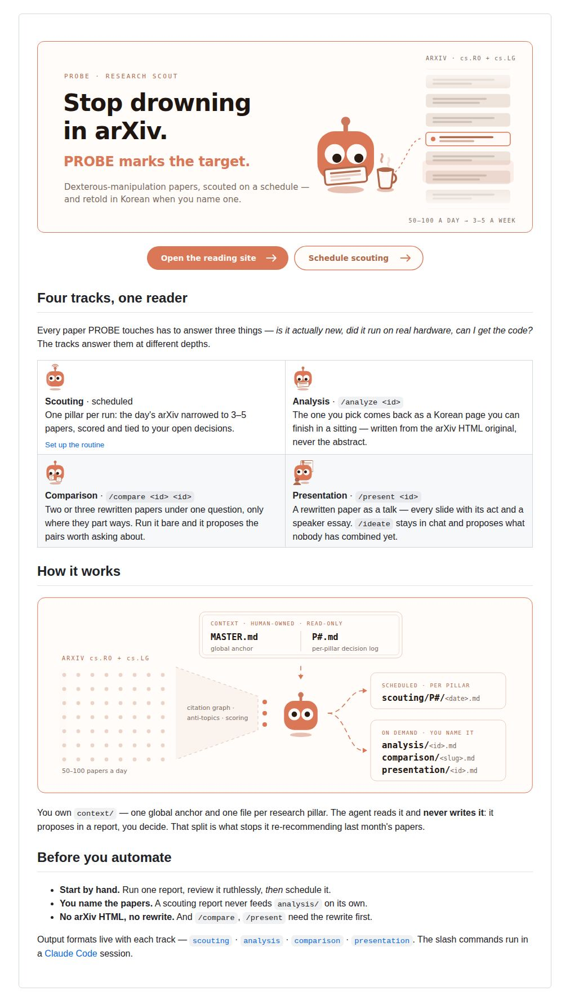
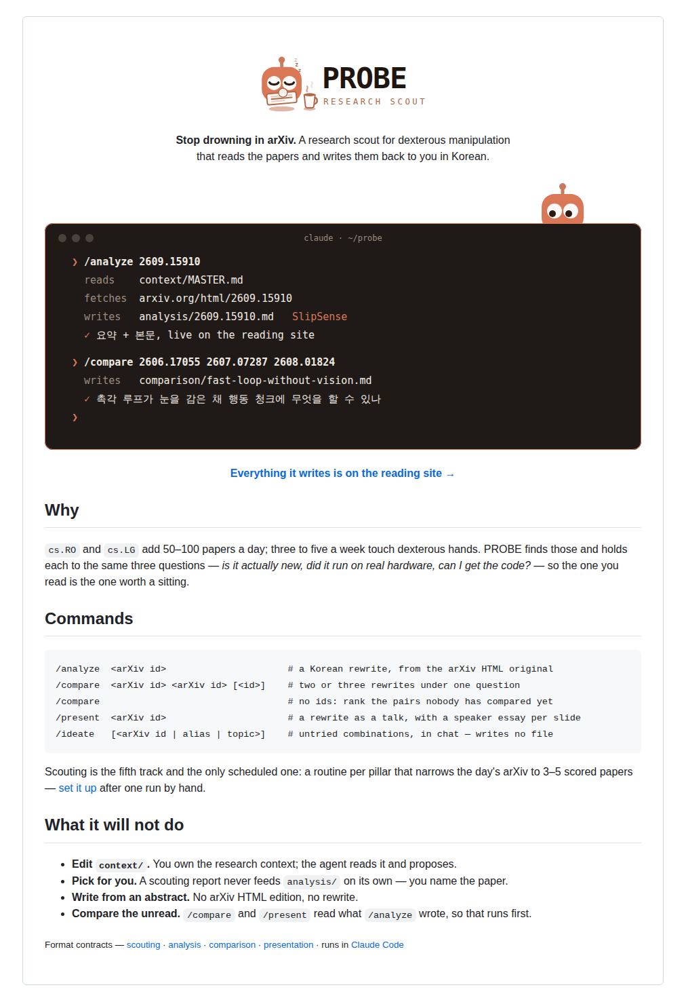
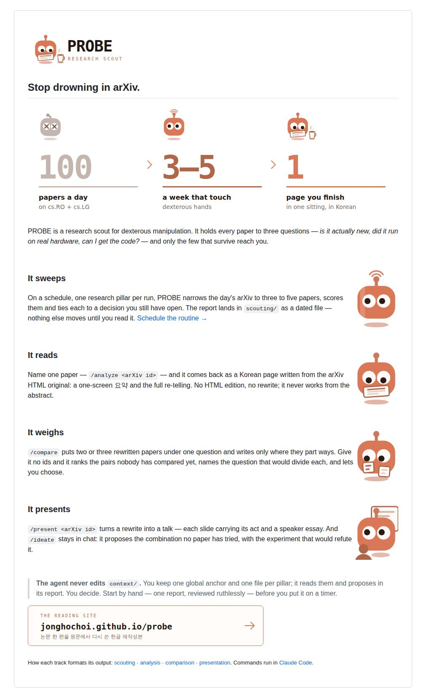
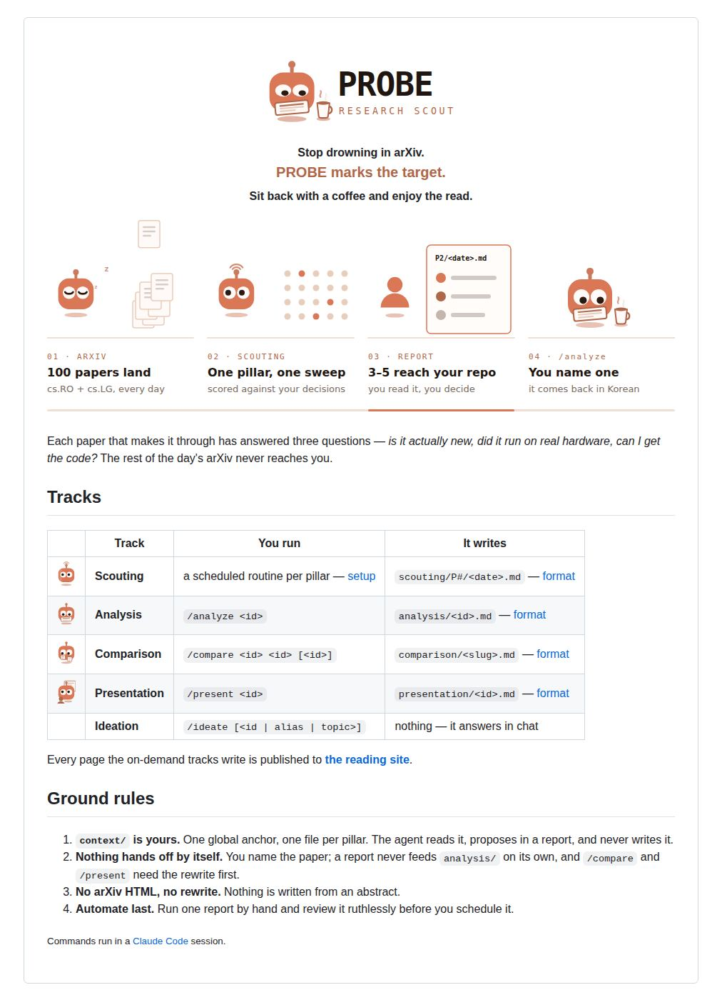
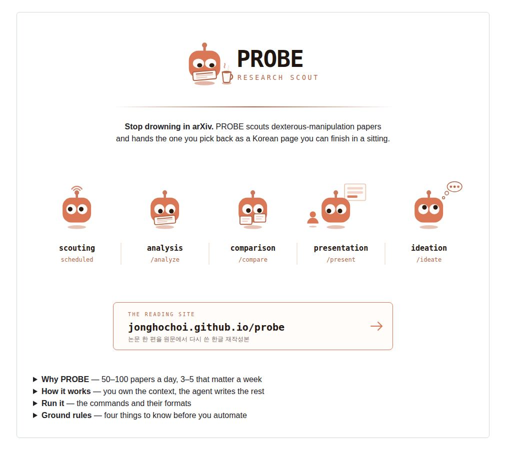
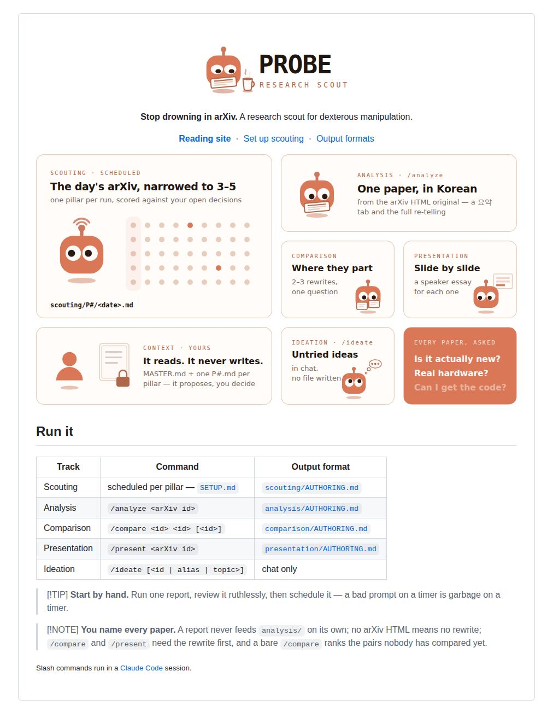
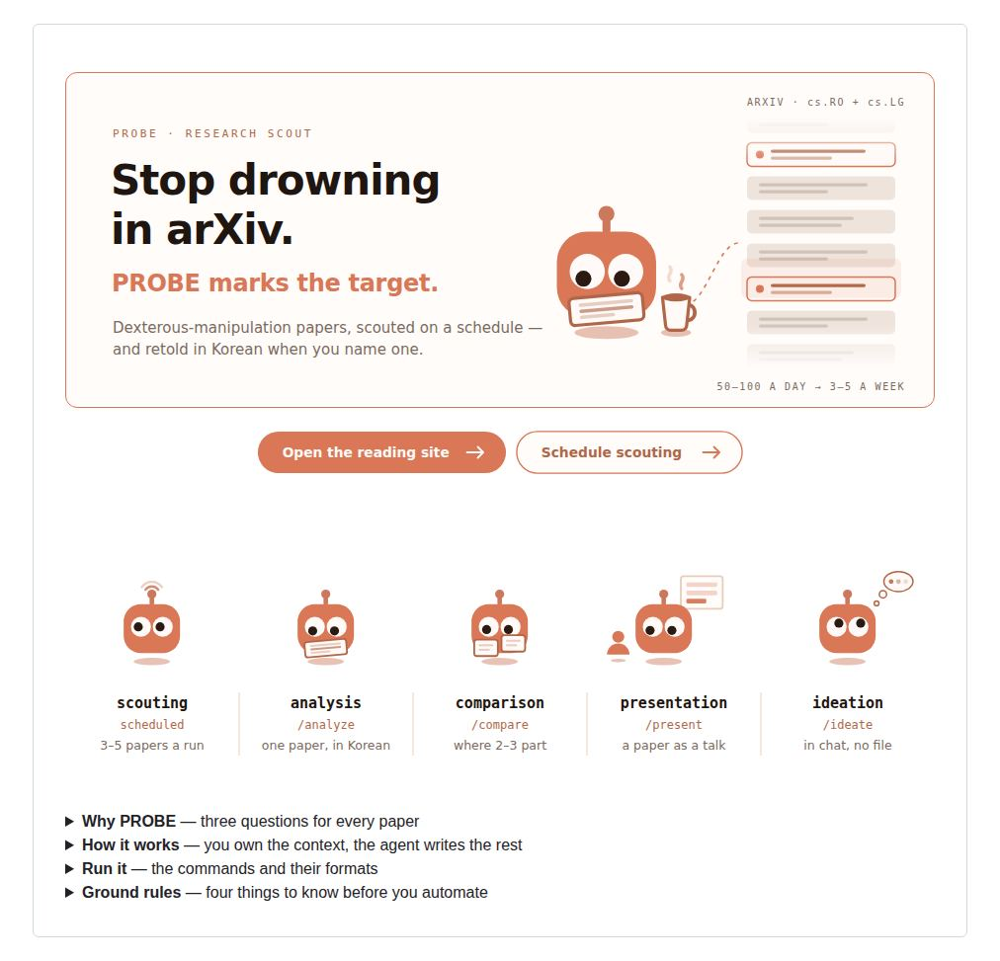

# README redesign proposals

Seven complete front-door drafts for the root `README.md`. Each folder holds a
`README.md` that GitHub renders in place — open it on this branch to see the
animations run — plus the light/dark SVG pairs it adds. Every draft keeps the
brand: the clay probe, its moods, the mono `PROBE` wordmark and the accent
palette of `assets/`; what changes is the layout, the ratio of text to
picture, and what gets said once instead of three times.

| | Proposal | Idea | New images |
|---|---|---|---|
| **A** | [Stage](A-stage/README.md) | A landing page: one wide hero carries the lockup, the claim and a live arXiv feed; two pill actions; the tracks as a 2×2 grid | `hero`, `btn-read`, `btn-setup` |
| **B** | [Session](B-session/README.md) | Show, don't tell: a terminal replays `/analyze` and `/compare` writing real files while the probe peeks over the window | `session` |
| **C** | [Editorial](C-editorial/README.md) | The argument as three numbers — `100 → 3–5 → 1` — then one short paragraph per verb (sweeps, reads, weighs, presents) beside its character | `funnel` |
| **D** | [Storyboard](D-storyboard/README.md) | One run as four panels with a progress rail; the folder and command tables merged into one | `story` |
| **E** | [Fold](E-fold/README.md) | Minimal first screen — lockup, one line, five tracks in a strip, the site — and every detail folded into `<details>` | `tracks` |
| **F** | [Bento](F-bento/README.md) | Every track, the `context/` boundary and the three questions as tiles on one board; GitHub alerts for the rules | `bento` |
| **G** | [Stage + Fold](G-stage-fold/README.md) | A's hero and actions over E's track strip, each track with a one-line note; everything else folded into `<details>` | `hero`, `btn-read`, `btn-setup`, `tracks` |

## At a glance

| A · Stage | B · Session | C · Editorial |
|:---:|:---:|:---:|
|  |  |  |
| **D · Storyboard** | **E · Fold** | **F · Bento** |
|  |  |  |
| **G · Stage + Fold** | | |
|  | | |

Dark-mode captures sit beside them in `shots/` (`*-dark.jpg`). The captures
are a frozen frame; the drafts themselves animate.

## What every draft drops

The current front door says several things more than once. Each draft keeps
one statement of each:

- **"3–5 papers"** — in the intro, the Why table and the flow diagram.
- **"The agent never edits `context/`"** — in the flow, the sentence under it,
  the folder table and the Pillars block.
- **The track list** — as the flow's output card, the folder table and the
  Use-it table.
- **The tagline** — a trio, an italic line and the site banner all
  introducing the reading site.

## Regenerating

The images are generated, one source for both themes, like
`assets/build-flow.py`:

```sh
cd proposals/readme
python3 build_a.py   # … build_g.py — each writes its folder's SVG pairs
```

`common.py` holds the palette (the same tokens as `build-flow.py`) and the
character, drawn on the 96-unit box of `assets/wordmark.svg`. Once a draft is
chosen, its images move into `assets/`, its `README.md` replaces the root one
with paths fixed, `assets/CLAUDE.md` gains rows for the new files, and this
folder is deleted.
